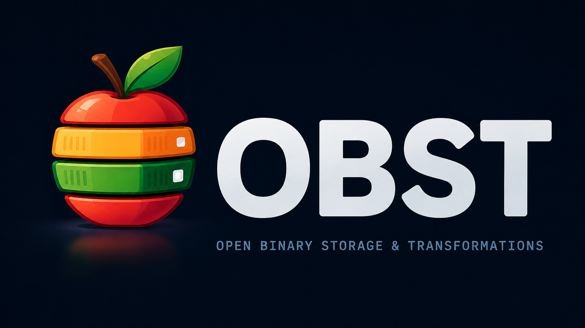
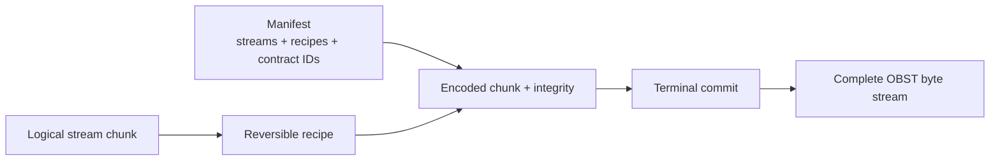

# OBST: OBST Binary Storage & Transformations

<p align="center">
  <br>
<sub>Illustration generated with ChatGPT.</sub>
</p>

> The fruity open container format.

> **Obst** /oːpst/, German, neuter noun<br>
>
> 1. fruit, collectively<br>
> 2. also a (recursive) binary container

## TL;DR: What is OBST?

OBST is a self-describing, streamable representation layer for logical byte
streams. It separates what those bytes mean from how they are stored, and makes
the stored form extensible through open, versioned, reversible pipelines.

Technically, OBST is an extensible binary container between a domain format and
storage or transport. It describes logical streams in independently framed
chunks, records their reversible representation as recipes, and protects both
stored and recovered bytes with integrity data.

**OBST is the format. The OBST toolchain is the reference ecosystem around
it.** This repository contains both, but they are not the same thing.

Read the layers from top to bottom:

| Layer                 | Game example          | Telemetry example |
| --------------------- | --------------------- | ----------------- |
| Application semantics | Game state            | Telemetry model   |
| Domain format         | SQLite                | MCAP              |
| Logical bytes         | SQLite database bytes | MCAP bytes        |
| **[OBST format](docs/format.md)** | **OBST** | **OBST** |
| Storage or transport  | S3 object             | Flash             |
| Actual transport      | HTTP over TCP         | Block device      |

Applications and domain formats own meaning and produce logical bytes. OBST
owns their reversible stored representation. Storage and transport own where
the resulting container lives and how it moves. The Python runtime, CLI, plugin
manager and plugins form the reference toolchain, not the wire contract.

An OBST byte stream contains:

- a manifest declaring streams, recipes and versioned extension contracts;
- logical byte streams split into independently framed chunks;
- integrity data for both stored and recovered bytes; and
- stable identifiers for stream types and reversible pipeline stages.

A recipe runs forward while encoding and backward while decoding:


The rule is short:

```text
decode(encode(input_bytes)) == input_bytes
```

Byte for byte.

The container records which logical streams exist, how each chunk was
represented and what a decoder needs to recover the original bytes. The
encoder may be simple or absurdly sophisticated. The decoder should not have
to care.

## Try it in 20 seconds (I timed it! :D)

Sure, from a checkout:

```bash
git clone https://github.com/SmolBlackHole/Obst.git
cd Obst
python -m pip install .
python -m pip install ./plugins/defaults
obst plugins enable obst-defaults
obst inspect samples/apple.obst
```

Inspection is native runtime tooling and needs no extension plugin. That
command validates the stored container without decoding the JPEG inside. The
enabled defaults plugin supplies the friendly file and zlib interpretation
shown below. Without it, the container remains structurally inspectable and
reports the missing local capabilities. The matching source image, two more
containers and complete Unsplash attribution live in [`samples/`](samples/).

The human-readable output includes the apple:

```text
                     ███████
                   ██    ██
             ██   █  █████
               █ █ ████

         █████████████████        OBST container 0.1-apple
       █████████████████████      -------------------------
                                  Streams                       1
     ████████████████████████     Recipes                       1
     ████████████████████████     Chunks                        6
                                  Container size                260.6 KiB
     ████████████████████████     Original size                 361.5 KiB (committed)
      ███████████████████████     Compression                   27.9% smaller (72.1% of original)
                                  Integrity                     valid (terminal commit and encoded CRCs)
        ███████████████████       Required decoders available   yes
          ██████████████          Logical recovery              not attempted

Streams
  [0] an_vision-gDPaDDy6_WE-unsplash.jpg
      obst.file@1 | 6 chunks | original 361.5 KiB | encoded payload 259.9 KiB
      Recipe usage: yes (6 total; recipe 0: 6)

Recipes
  [0] obst.zlib@1(compression_level=9) | 6 chunks

Resource footprint
  Manifest 310 B | largest chunk 64.0 KiB logical / 63.1 KiB encoded
  Stage executions 6 | largest stream 361.5 KiB if materialized

Stage capabilities
  obst.zlib@1 (zlib): decoder available
      Declared by recipe: 0
      Used by chunks: yes (6 total; recipe 0: 6)
      zlib-wrapped DEFLATE with a declared compression level.
      Declared specification: https://github.com/SmolBlackHole/Obst/blob/main/plugins/defaults/docs/contracts/stages/zlib.md
      Local specification: https://github.com/SmolBlackHole/Obst/blob/main/plugins/defaults/docs/contracts/stages/zlib.md
```

The runtime can also emit the same inspection as JSON:

```bash
obst inspect data.obst --json
```

The same plugin contributes portable-file packing and extraction:

```bash
obst pack apple.jpg banana.jpg -o fruit.obst
obst unpack fruit.obst -o restored
```

The Python project deliberately ships as 2 distributions:

- `obst` provides the `obst` package, the plugin manager and native structural
  inspection; and
- `obst-defaults` provides the replaceable first-party Extensions plus the
  `pack` and `unpack` commands.

Installing a distribution only makes its plugin discoverable. Persistent
enablement, one-shot selection or an explicit conformance test is the separate
host decision that permits its Python code to execute.

The [command-line guide](docs/cli.md) documents stdin, flags, JSON output and
archive safety rules. The [runtime error reference](docs/errors.md) owns exit
codes and failure examples. For a complete snapshot of the current toolchain,
see the [human-readable CLI output](docs/cli-output-reference.md) and the
[JSON output reference](docs/cli-json-output-reference.md).

## But why would I want another container format?

Honestly, you probably don't. OBST is not a universal replacement for ZIP, TAR,
Parquet, SQLite, JPEG or any other established format. It is a general-purpose
container for heterogeneous byte streams and reversible processing pipelines.

The idea is: Different bytes expose different structure. That's it, seriously.

Some examples:

- Slowly changing sensor values may benefit from delta encoding.
- Fixed-width records may become more compressible after byte shuffling or as I'd
  like to call it _shaking them really hard_.
- Monotonic counters may want a different recipe than temperatures.
- An already compressed image may benefit from absolutely nothing. That is
  completely fine.

For the last case, the correct recipe is simply:

```text
RAW
```

Knowing when _not_ to transform data is part of the job.

OBST separates the container contract from the encoder's decisions. A tiny
device may use one cheap recipe. An archival tool may benchmark hundreds of
candidates, inspect the input or consult the alignment of the planets and
stars. Both can emit ordinary OBST.

## Soo... what can I put in it?

Anything that eventually becomes bytes is _technically_ eligible. This is not
the same as saying everything should become OBST, it probably shouldn't.

One container may hold streams that have very little in common:

```text
metadata.json       -> zlib
measurements.bin    -> delta8 -> zlib
photo.jpg           -> RAW
```

Existing formats do not have to stop being themselves and neither of us should
force them to. A stream may contain JPEG, SQLite, Parquet, ZIP, PDF or
your yearly Minecraft world with the bois and gals. OBST sits around those bytes
as a representation layer. It does not demand that the world convert everything
into fruit.

This makes it useful for heterogeneous technical datasets, telemetry,
application exports, storage objects, backup inputs and reversible codec
experiments. These domains are not secretly the same. They just share a need
to separate logical data from its stored representation.

## Should everything become OBST?

No.

If you want to send three holiday photos to somebody, use ZIP, seriously. If
an established domain format already solves the problem, use it. If the only
goal is to make one file as small as possible, a specialized compressor will
probably beat a container that also owns streams, integrity and
recoverability.

OBST becomes interesting when the question is not only:

> How do I compress these bytes?

but:

> How should these bytes be represented, described, transported and recovered
> without permanently coupling that decision to one codec or application?

## Does OBST understand what those bytes mean?

Nah. The application still owns their meaning and may define stream types such
as:

```text
org.example/table@1
org.example/timeseries@2
org.example/model-weights@1
```

Stream profiles may describe filenames, timestamps, units, array shapes or
other application-owned metadata. The core only needs enough information to
recover logical bytes. This is often for the best.

Numeric scaling, quantization and record layouts therefore belong to versioned
stream profiles, not allegedly lossless stages. The
[design notes](docs/design.md#numeric-representation-and-scale) explain why
ordinary numeric equality is not enough.

## Can I extend it?

Yes. `obst.bytes@1` is the one core stream contract; the shipped RAW, zlib,
Delta8 and portable-file capabilities are ordinary Extensions from the
separately installed `obst-defaults` plugin. Third-party code uses the same
registry and provider contracts. There is no first-party VIP entrance.

Only Stage and stream-profile IDs enter container bytes. Carriers and
packagers are runtime capabilities chosen by the host. The
[extension guide](docs/extensions/README.md) maps those boundaries, while the
[plugin guide](docs/extensions/plugins.md) explains installation, activation
and the trusted-code boundary.

## How do the pieces fit together?

Inside the representation layer, declarations connect to the chunks that use
them:



The manifest appears before the chunks and declares streams, recipes and
extension IDs. Each chunk selects a declared recipe. Encoding runs that
recipe forward; decoding runs it backward. A terminal commit closes the stream
and binds the complete representation without requiring a seekable carrier.

The [anatomy guide](docs/anatomy.md) walks through the relationships. Exact
headers and offsets live in the [format specification](docs/format.md).

## Is an OBST container always a file?

No. The byte stream is the format. A `.obst` file is one possible carrier.
The same bytes may live in memory, flash, a database BLOB, an object store or
anything else that can move binary data without becoming creative about it.

The [reader is single-pass](docs/core/reading.md#structural-reading) and does
not require seeking, so bytes may arrive through stdin, a socket or an HTTP
body before somebody stores them in a place they will eventually call
cloud-native. The carrier changes. The container does not.

The plugin's [file handling](plugins/defaults/docs/files/README.md)
is an adapter around the core, not a secret filesystem model hiding inside it.

## What happens if a decoder is missing?

The container remains [structurally inspectable](docs/core/inspection.md). The
manifest declares the available recipes and stages before the first payload
chunk arrives. Which stages are actually required depends on the recipes
referenced by the chunks.

An unknown stage does not make the framing invalid, but chunks that actually
use it cannot be decoded locally. OBST does not download missing decoders
automatically. That particular supply-chain adventure remains opt-in.

## What if mommy and daddy have different encoders?

Different encoders are fine. The receiver only needs decoders for the stages
the sender actually uses. OBST can expose that mismatch through the manifest,
but it does not negotiate a shared capability set before the sender starts.

A constrained device can still write bounded chunks with a cheap,
memory-conscious recipe, and a stronger machine can consume and later repack
the same logical data. The sensor does not need to know that a server with
considerably more electricity will judge its compression choices.

Capability negotiation does not exist yet. The planned runtime extension lets
a receiver advertise supported decoders, profiles and limits before a sender
builds an ordinary OBST stream. It is tracked in the
[roadmap](ROADMAP.md#later-directions).

## What does `0.1-apple` mean?

The wire format is [`OBST 0.1-apple`](docs/format.md#version-identity).

The numeric major and minor are stored in the container and manifest headers.
`apple` is the stable human-readable codename for major version `0`, so every
`0.x` revision remains `apple`.

> [!NOTE]
> **Reserved semantics:** After the first compatibility freeze, an incompatible
> format major receives a new number and a new codename.

Stage and stream-type versions are independent. A new container major does not
silently redefine `obst.delta8@1`.

## How weird does this get?

### Does the format choose the recipe?

No. Recipe search belongs to the encoder, not the wire format. A tuner may try
several candidates and store only the winner. The decoder sees the chosen
recipe, not the search history or the encoder's emotional journey.

The reference implementation does not include production tuning. That work
needs typed candidates, exact round trips, resource budgets and a packaging
lifecycle. The [design notes](docs/design.md#the-encoder-may-be-clever) explain
the manifest-first constraint.

### Can OBST contain another OBST container?

An OBST stream is bytes. Those bytes may themselves be another complete OBST
container:

```text
OBST(OBST(OBST(...)))
```

This is [valid composition](docs/design.md#recursion-is-composition), not an
instruction to recurse automatically. Recursive tools need explicit selection
plus depth and size limits.

May God have mercy on your stack.

### Is OBST an archive format?

The core is not. The CLI can pack explicit files as independent
[`obst.file@1`](plugins/defaults/docs/contracts/streams/file.md) streams and restore their
basenames and exact bytes. The [portable file adapter](plugins/defaults/docs/files/README.md)
belongs to extensions and tools around the byte-stream container.

In German, an `Obstkorb` is a fruit basket. A cold-storage profile therefore
has an obvious and largely, unfortunately, unavoidable name: `OBSTkorb`.

## Development

The reference implementation targets Python 3.14. Its `src`, `tests` and
`scripts` trees are checked with strict typing.

```bash
python -m venv .venv

# Linux/macOS
. .venv/bin/activate

# Windows PowerShell
.venv\Scripts\Activate.ps1

python -m pip install -e ".[dev]" -e ./plugins/defaults -e ./examples/plugin_adaptive_zlib
obst plugins enable obst-defaults
python scripts/quality.py
```

The quality command runs Ruff, formatting checks, isort, mypy strict and
Pyright strict for the runtime. It also runs the runtime, `obst-defaults` and
Adaptive-Zlib test suites. Safe mechanical fixes are available through:

```bash
python scripts/quality.py --fix
```

[GitHub Actions](.github/workflows/quality.yml) runs the same quality command
on Linux and Windows for pushes and pull requests.

## Documentation

Start with the [documentation index](docs/README.md). It routes format authors,
application developers, extension authors and CLI users to the authoritative
page instead of making this README impersonate a small book. For the shortest
paths, see the [anatomy](docs/anatomy.md), [format specification](docs/format.md),
[CLI guide](docs/cli.md), [extension guide](docs/extensions/README.md) and
[roadmap](ROADMAP.md).

## Status

OBST is experimental and under active development. The v0.1 vectors pin the
current draft, but compatibility has not frozen and intentional pre-freeze wire
changes regenerate them.

The runtime reads and writes chunked containers and inspects missing
capabilities. The explicitly activated `obst-defaults` plugin supplies RAW,
Delta8, zlib and portable-file tooling without a privileged loading path.

The reference implementation and first-party tooling are open source under the
[Mozilla Public License 2.0](LICENSE).

## How this happened

This did not start as a plan to invent another container format.

Around 2023 or 2024, early in my studies and roughly in my third semester, I
got a Shelly Smart Plug. I wanted to know how much energy my setup used and
switch it off while I was away instead of quietly paying for idle power.

The original plan was small: a battery-powered ESP would poll the Shelly and
store measurements in flash. I had no database ready, so the device needed a
compact local format. I wrote one, including a compression pipeline for the
sensor readings.

I found the code again a few years later. The Shelly-specific parts were less
interesting than the pipeline, so I started feeding it other things: images, a
database, source code, plain text and my bachelor's thesis. Then I put an OBST
file through it. That worked too.

The trick was not Shelly data. It was bytes. The pipeline rearranged them so
zlib could see patterns it had missed before. Turning that into a general
container was the next logical step.

Logical in the sense that packing OBST inside OBST can be called logical.

$$ OBST(OBST(OBST(...))) $$

The name came from an endian bug in the old prototype. It represented the ASCII
magic `OBST` as the integer `0x4F425354` and serialized that integer
little-endian. The file began with:

```text
54 53 42 4F
 T  S  B  O
```

TSBO was not intentional. The bug was fixed but the fruit stayed. Why OBST?

Honestly, I have no idea. It was a placeholder, and it stuck.

## Spare a starfruit? ⭐ :D

If you've read this far, consider leaving a star on the repository.
It helps me see that people are interested in the project and gives me
another excuse to keep turning random things into fruit. Thank you! :D

## License

OBST is licensed under the [Mozilla Public License 2.0](LICENSE). MPL-2.0
applies file-level copyleft: changes to covered files remain available under
MPL-2.0, while independently written Extensions may use another license.

The license does not force an independent Extension to publish its decoder.
Wire-visible Extensions proposed for first-party distribution must therefore
document their decoding contract publicly. An encoder may remain proprietary;
recovering the bytes must not require guessing what it did.
