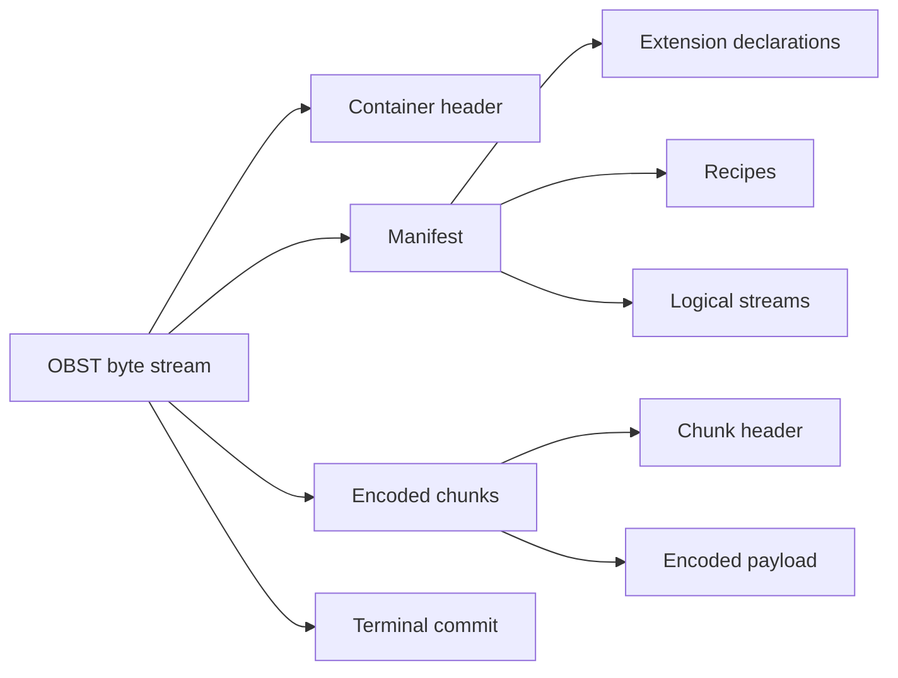
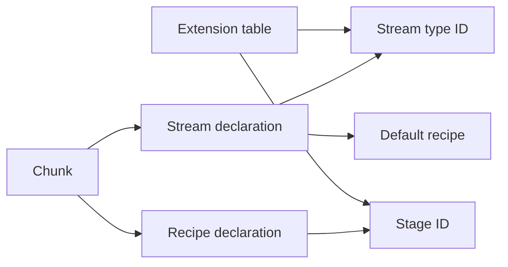
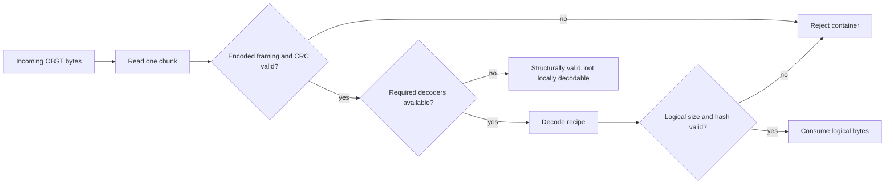
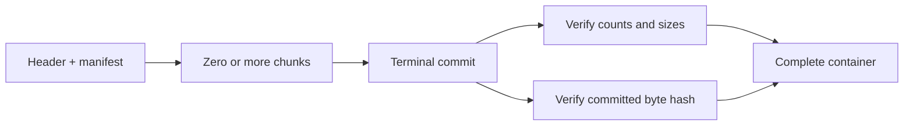
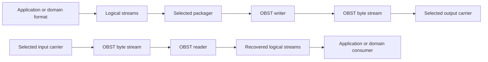

# The anatomy of an OBST container

Parent: [Documentation index](README.md)

OBST is a self-describing, streamable representation layer for logical byte
streams. This page explains how that layer turns logical bytes into one
reversible, integrity-protected container byte stream. It is conceptual; exact
sizes, offsets and validity rules live in the [binary format](format.md).

## Table of contents

- [The anatomy of an OBST container](#the-anatomy-of-an-obst-container)
	- [Table of contents](#table-of-contents)
	- [The pieces at a glance](#the-pieces-at-a-glance)
	- [The outer shape](#the-outer-shape)
	- [The manifest is the map](#the-manifest-is-the-map)
	- [Streams own logical identity](#streams-own-logical-identity)
	- [Recipes describe reversible representation](#recipes-describe-reversible-representation)
	- [Chunks make the stream bounded](#chunks-make-the-stream-bounded)
	- [The terminal commit proves completeness](#the-terminal-commit-proves-completeness)
	- [Unknown does not mean invalid](#unknown-does-not-mean-invalid)
	- [Where the bytes go](#where-the-bytes-go)

## The pieces at a glance

OBST begins after an application or domain format has produced logical bytes.
It ends when a complete OBST byte stream is ready for a caller-selected
carrier. Storage, transport and application meaning remain outside that
boundary. These names describe the parts inside and directly around it:

| Term                                                      | Meaning                                                                                                           |
| --------------------------------------------------------- | ----------------------------------------------------------------------------------------------------------------- |
| [Container](#the-outer-shape)                             | One complete OBST byte stream: header, manifest, chunks and terminal commit.                                      |
| [Container header](format.md#container-header)            | Fixed opening record containing the format version and bounded information needed to read the manifest.           |
| [Manifest](format.md#manifest)                            | The declarations of extension IDs, recipes and logical streams available to the following chunks.                 |
| [Extension declaration](format.md#extension-table)        | One versioned stream-type or stage ID plus an optional specification URL.                                         |
| [Stream](#streams-own-logical-identity)                   | One ordered logical byte sequence with a stream-type ID, metadata and default recipe.                             |
| [Stream type](extensions/profiles.md)                     | A versioned contract describing what a stream's recovered bytes and metadata mean.                                |
| [Stage](extensions/stages.md)                             | One versioned reversible byte-to-byte operation applied independently to a chunk.                                 |
| [Stage provider](extensions/stages.md#provider-protocols) | A locally trusted encoder, decoder or codec implementation for one stage ID. It is not stored in the container.   |
| [Recipe](core/recipes.md#execute-one-recipe)              | An ordered list of stage IDs and their parameter bytes. It describes how chunk bytes are represented.             |
| [Chunk](core/recipes.md#execute-one-chunk)                | One independently framed part of a stream, encoded with one recipe and bound to sequence and integrity data.      |
| [Terminal commit](format.md#terminal-commit-record)       | The closing record that binds total counts, sizes and preceding bytes, proving the container is complete.         |
| [Carrier](extensions/carriers.md)                         | A runtime adapter that binds a caller-selected source, streaming destination or transactional publication target. |

The manifest and chunks name contracts, not Python implementations. A local
`ExtensionRegistry` maps those wire-visible IDs to trusted providers when an
operation needs to encode, decode or interpret them. Carrier and packager IDs
are runtime capabilities, so they never enter this anatomy.

## The outer shape

An OBST container is one byte stream:

```text
container header | manifest | chunk | chunk | ... | terminal commit
```



The header identifies the OBST format line and gives the reader enough bounded
information to read the manifest. The manifest describes the declared stream
and recipe structure before the first payload arrives. Chunks then carry
encoded pieces of those logical streams. The terminal commit binds the complete
preceding representation and distinguishes a finished container from a stream
that merely stopped on a convenient byte boundary.

The byte stream is the format. A `.obst` filesystem entry is one possible
carrier, not a different kind of container.

## The manifest is the map

The manifest contains three related declarations:

- extension entries name stream contracts and recipe stages;
- recipes define ordered reversible stage chains; and
- streams define logical byte sequences, their metadata and default recipes.



Every reference is explicit. A chunk names its stream and recipe. A recipe
names its stages. A stream names the contract that gives its recovered bytes
meaning.

The optional specification URL attached to an extension declaration is
untrusted provenance. It may help a human find the named contract, but it is
not a download instruction and does not make a decoder available.

## Streams own logical identity

A stream is an ordered logical byte sequence with:

- a numeric ID inside this container;
- a stable stream-type identifier;
- opaque, stream-owned metadata; and
- a default recipe.

`obst.bytes@1` means opaque logical bytes with empty metadata. Other contracts
can define filenames, timestamps, table schemas or record layouts. The core
does not interpret those values merely because it can recover the bytes.

Different streams may use different recipes. A JPEG can remain RAW while
measurements use delta8 followed by zlib. One container does not force every
payload to pretend that the same representation is equally clever.

The normative shipped stream contracts are indexed under
[contracts/streams](contracts/streams/).

## Recipes describe reversible representation

A recipe is an ordered list of versioned stages. Encoding runs from first to
last. Decoding resolves the same stage IDs and applies their inverse operations
in reverse order.


The invariant is byte-exact:

```text
decode(encode(logical_bytes)) == logical_bytes
```

The container records the chosen recipe, not why an encoder chose it. RAW,
zlib and delta8 use the same public Stage API as a third-party implementation.
Their language-neutral definitions live under
[contracts/stages](contracts/stages/).

## Chunks make the stream bounded

Each chunk binds one encoded payload to:

- a stream ID;
- a per-stream sequence number;
- a recipe ID;
- the encoded and logical sizes;
- integrity data for the encoded payload; and
- a hash of the logical bytes a decoder must recover.

Chunks from different streams may be interleaved. Sequence numbers still make
the order inside each logical stream unambiguous.

Independent framing lets a reader validate and decode bounded pieces without
seeking or loading the complete container into memory.



Structural inspection stops before recipe execution. It validates stored
framing, payload CRCs and the terminal commitment, then reports whether the
decoders required by actual chunks are available locally. Successful inspection
is therefore not a claim that logical recovery was attempted.

## The terminal commit proves completeness

Chunk-local integrity can prove that an observed chunk is intact. It cannot
prove that another complete chunk was not removed from the end. The terminal
commit closes that gap without requiring a seekable carrier:



The writer accumulates the commitment while streaming and writes the terminal
record only from `finish()`. The reader accepts clean EOF only after that record
has matched everything it observed. A missing terminal record is truncation.

Chunk iterators may yield individually validated chunks before the final record
arrives. A consumer that publishes recovered data must therefore commit its own
output only after exhausting the iterator successfully.

## Unknown does not mean invalid

An implementation may encounter a stage such as
`org.example/something-strange@2` without having its decoder. The container can
still be structurally valid and inspectable.

Likewise, an implementation may recover every logical byte from an unknown
stream type without understanding the payload's application semantics:

```text
container structurally valid: yes
logical bytes recoverable:    yes
stream semantics understood:  no
```

Those are separate capabilities. The distinction is what lets OBST remain
self-describing without requiring every implementation to understand every
application.

## Where the bytes go

The same boundary works in both directions. The core reads and writes
structural binary I/O; application adapters and carriers connect it to the
world without becoming part of the format:



The filesystem, a database row, an HTTP response and an object key are carrier
facts. They never become part of the OBST container merely because the bytes
happen to pass through them. A carrier provider may bind a host-specific
request to a `BinaryReader`, a progressively visible `BinaryWriter` or a
transactional publisher. The core still receives only the structural endpoint,
never its path, key, credentials or transport policy.

Continue with the [binary format](format.md) for exact bytes, the
[core API](core/) for Python operations, or the [extension system](extensions/)
for custom stages and stream profiles.
