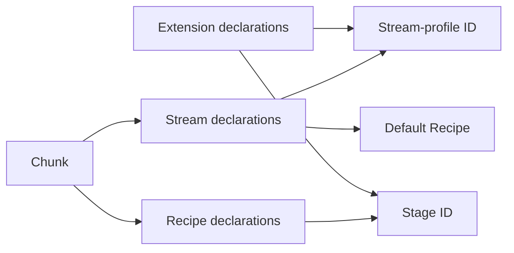
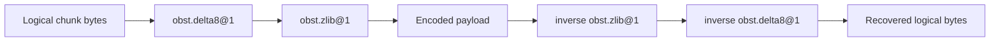
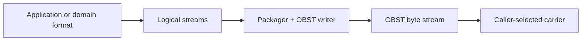

# The anatomy of an OBST container

Parent: [Documentation index](README.md)

<!--
SPDX-FileCopyrightText: 2026 SmolBlackHole
SPDX-License-Identifier: CC-BY-ND-4.0
-->

OBST sits between logical byte streams and the place that carries the finished
container bytes. This page introduces the parts inside that boundary and shows
how they fit together. The [binary format](format.md) owns exact fields, sizes
and validity rules.

## Table of contents

- [The anatomy of an OBST container](#the-anatomy-of-an-obst-container)
	- [Table of contents](#table-of-contents)
	- [The pieces at a glance](#the-pieces-at-a-glance)
	- [The outer shape](#the-outer-shape)
	- [The manifest is the map](#the-manifest-is-the-map)
	- [Streams own logical identity](#streams-own-logical-identity)
	- [Recipes describe reversible representation](#recipes-describe-reversible-representation)
	- [Chunks make the stream bounded](#chunks-make-the-stream-bounded)
	- [The terminal commit proves completeness](#the-terminal-commit-proves-completeness)
	- [Unknown does not mean invalid](#unknown-does-not-mean-invalid)
	- [Where the bytes go](#where-the-bytes-go)

## The pieces at a glance

| Term                                                        | Meaning                                                                                  |
| ----------------------------------------------------------- | ---------------------------------------------------------------------------------------- |
| [Container](#the-outer-shape)                               | One complete OBST byte stream: header, manifest, chunks and terminal commit.             |
| [Container header](format.md#container-header)              | The opening record that identifies the format version.                                   |
| [Manifest](format.md#manifest)                              | The declarations that chunks may reference: Extension IDs, Recipes and logical streams.  |
| [Extension declaration](format.md#extension-table)          | One versioned stream-profile or Stage ID, plus an optional specification URL.            |
| [Stream](#streams-own-logical-identity)                     | One ordered logical byte sequence with a stream-profile ID, metadata and default Recipe. |
| [Stream profile](toolchain/extension-api/profiles.md)       | A versioned contract for the meaning of one stream's recovered bytes and metadata.       |
| [Stage](toolchain/extension-api/stages.md)                  | One versioned, reversible byte-to-byte operation applied to an individual chunk.         |
| [Recipe](#recipes-describe-reversible-representation)       | An ordered list of Stages and their parameter bytes.                                     |
| [Chunk](#chunks-make-the-stream-bounded)                    | One independently framed part of a stream, stored through one Recipe.                    |
| [Terminal commit](#the-terminal-commit-proves-completeness) | The closing record that proves the container is complete.                                |
| [Carrier](toolchain/extension-api/carriers.md)              | Runtime tooling that connects a complete OBST byte stream to a source or destination.    |

The container names contracts, not classes or installed packages. A local
implementation may provide those contracts, but its loading and composition
mechanism is not part of the container.

## The outer shape

Every OBST container has the same top-level order:

```text
container header | manifest | chunk | chunk | ... | terminal commit
```


The header identifies the format line. The manifest arrives before any
payload and declares the IDs that later records may use. Chunks carry encoded
pieces of logical streams. The terminal commit closes the sequence and proves
that the container did not merely stop at a valid-looking boundary.

The byte stream is the format. A `.obst` file is only one place those bytes
may live.

## The manifest is the map

The manifest connects three tables:



A stream declaration names its profile and default Recipe. A Recipe names its
Stages. Every chunk then names the stream and Recipe it actually uses. The
chunk's Recipe ID is authoritative, so one stream may use different Recipes
for different chunks.

An Extension declaration may point to its public specification. The URL helps
readers find the contract. It never installs code or activates a plugin.

## Streams own logical identity

A stream is an ordered sequence of logical bytes. Its declaration gives it a
container-local numeric ID, a stable stream-profile ID, opaque metadata and a
default Recipe.

The built-in `obst.bytes@1` profile means opaque logical bytes with empty
metadata. Other profiles may define filenames, timestamps, table schemas or
record layouts. Those meanings belong to the profile and the application, not
to the container framing.

Streams remain independent inside one container. For example:

```text
metadata.json       -> Recipe 0
measurements.bin    -> Recipe 1
photo.jpg           -> Recipe 2
```

The built-in profile is defined by the [format specification](format.md#obstbytes1-stream-contract).
Independent versioned contracts are routed through the
[contract index](contracts/README.md).

## Recipes describe reversible representation

A Recipe describes an ordered pipeline of versioned Stages. Encoding applies
them from first to last. Decoding applies their inverse operations in reverse
order.



The required invariant is byte-exact:

```text
decode(encode(logical_bytes)) == logical_bytes
```

The Stage list may be empty. Such a Recipe is the canonical identity
representation: stored payload bytes equal the logical chunk bytes and no
Stage decoder is required.

The container records the selected Recipe, not the search that selected it.
The concrete IDs above belong to the
[`obst-defaults` Stage contracts](../plugins/defaults/docs/contracts/stages/README.md).
They use the same public Stage contracts as third-party Extensions.

## Chunks make the stream bounded

Each chunk is one independently framed part of a logical stream. It selects its
stream and Recipe, carries its position within that stream and includes the
integrity information needed to validate stored and recovered bytes.

Chunks from different streams may be interleaved:

```text
stream 0, sequence 0
stream 1, sequence 0
stream 0, sequence 1
```

Sequence numbers preserve the order within each stream. Independent framing
lets readers validate and decode bounded pieces without seeking or loading the
whole container into memory.

The [format specification](format.md#chunk-framing) defines the fields and
validation rules. The [reading guide](toolchain/reading.md) explains how the
Python runtime exposes encoded and recovered chunks.

## The terminal commit proves completeness

A valid chunk proves only that the chunk itself arrived intact. The terminal
commit closes the full sequence and distinguishes a complete container from a
stream that stopped after an otherwise valid chunk. The
[format specification](format.md#terminal-commit-record) owns the exact
commitment and EOF rules.

A streaming reader may yield individually validated chunks before it reaches
the commit. Consumers must therefore delay publication of recovered output
until the complete operation finishes successfully. The Python lifecycle is
documented under [reading](toolchain/reading.md) and
[writing](toolchain/writing.md).

## Unknown does not mean invalid

OBST separates three questions:

1. Is the container structurally valid?
2. Are the required Stage decoders available locally?
3. Does the application understand each stream profile?

A container that uses `org.example/something-strange@2` may pass structural
inspection even when no decoder for that Stage is available. If all Stages are
available but a stream profile is unknown, an implementation may still recover
the logical bytes without understanding their application meaning.

This distinction keeps framing, byte recovery and application semantics from
collapsing into one all-or-nothing result.

## Where the bytes go

Application adapters produce or consume logical streams. Packagers choose how
to represent input chunks. Carriers move the completed container byte stream.
None of those runtime choices changes the format.



A filesystem path, database key, HTTP request or object-store credential is a
carrier concern. An OBST reader or writer receives binary endpoints, not those
host-specific details.

Continue with the [binary format](format.md) for exact bytes, the
[toolchain guide](toolchain/) for Python operations, or the
[Extension system](toolchain/extensions.md) for provider contracts and
composition.
