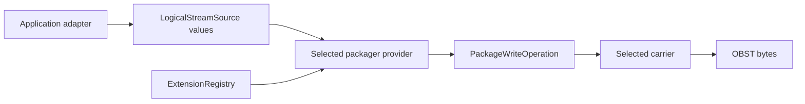

# Packaging

Parent: [Core API](README.md)

Packaging turns declared logical streams into an operation that writes one
valid OBST byte stream. The core owns shared source and result contracts;
replaceable policy lives in packager extensions. Carriers decide where the
resulting container bytes go.

## Table of contents

- [Packaging](#packaging)
	- [Table of contents](#table-of-contents)
	- [The boundary](#the-boundary)
	- [Define one logical source](#define-one-logical-source)
	- [Resolve a packaging policy](#resolve-a-packaging-policy)
	- [Write or publish the operation](#write-or-publish-the-operation)
	- [Concrete policy example](#concrete-policy-example)
	- [Resource policy](#resource-policy)

## The boundary



`LogicalStreamSource`, `PackageWriteOperation` and `PackageResult` are public
core contracts. A concrete packager decides how recipes and streams become a
manifest and chunks. A concrete [carrier](../extensions/carriers.md) owns the
endpoint and its visibility or transaction semantics.

Packager and carrier IDs are runtime identities. They are never serialized
into the manifest. Only the stage and stream-type contracts referenced by the
produced container appear there.

## Define one logical source

```python
from obst.core import (
    BYTES_STREAM_TYPE,
    LogicalStreamDescriptor,
    LogicalStreamSource,
    RecipeSpec,
    StageSpec,
)

recipe = RecipeSpec(
    (
        StageSpec(
            "org.example/codec@1",
            b"\x09",
        ),
    ),
)
descriptor = LogicalStreamDescriptor(
    stream_type=BYTES_STREAM_TYPE,
    metadata=b"",
    default_recipe=recipe,
)
source = LogicalStreamSource.from_bytes(
    descriptor,
    b"logical bytes",
    chunk_size=64 * 1024,
)
```

Use `RecipeSpec(())` when the encoded payload should equal the logical bytes.
That identity Recipe does not require a Stage provider.

`LogicalStreamSource.from_bytes()` requires an explicit `chunk_size`. Chunking
is packaging policy, not a decoder requirement or a core-owned default. The
chosen size remains subject to `CoreResource.LOGICAL_CHUNK_BYTES` in the
selected policy.

For streaming input, declare the largest possible chunk before supplying the
iterable:

```python
source = LogicalStreamSource(
    descriptor,
    chunks,
    max_chunk_bytes=64 * 1024,
)
```

Every yielded value must be exact built-in `bytes` and fit the declaration.
Sources are single-use; requesting their iterator twice raises
`SourceConsumedError`.

## Resolve a packaging policy

The host selects one exact packager ID from an already composed immutable
registry, then passes that provider its own typed request. Registry lookup does
not activate a plugin, invoke the provider or validate its eventual result.
Container bytes cannot select a packaging policy.

A missing provider raises `MissingExtensionCapabilityError` before preparation.
The [packager extension guide](../extensions/packagers.md) owns the provider
contract. A concrete plugin owns its request value and packaging policy.

## Write or publish the operation

A `PackageWriteOperation` writes to a caller-supplied `BinaryWriter`. The host
may supply a progressively visible endpoint or ask a carrier to bind a
transactional publisher. The
[carrier guide](../extensions/carriers.md#writer-and-publisher-semantics) owns
visibility, commit, abort and publication receipts.

`PackageResult` reports the final manifest, complete encoded size, chunk count
and per-stream logical accounting. It deliberately contains no carrier path,
object key or publication reference.

## Concrete policy example

The separately installed `obst.fixed@1` provider implements the shared
contracts above. Its
[plugin-owned extension page](../../plugins/defaults/docs/packagers/fixed.md)
owns manifest construction, determinism, preflight and exact policy semantics.

Other packagers can return the same `PackageWriteOperation` contract after
making different recipe, chunking or reuse decisions. The
[packager extension guide](../extensions/packagers.md) defines that replaceable
boundary.

## Resource policy

Core sources, recipe execution and container writing accept the public
`ResourceAccounting`. A Packager decides how its request exposes that
operation state. No private mutable budget object crosses extension boundaries.

The [resource guide](resources.md) documents defaults and structured refusal.
