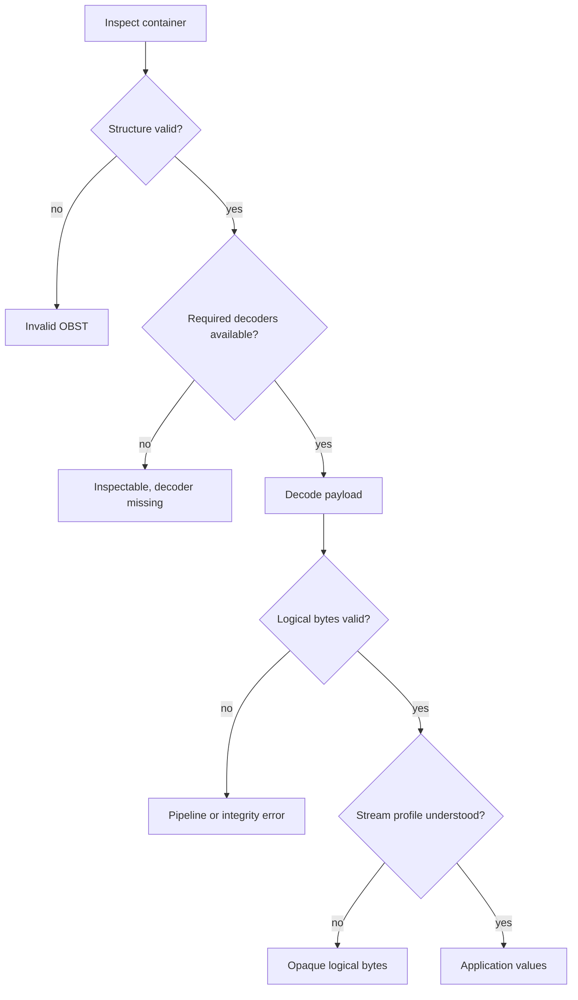
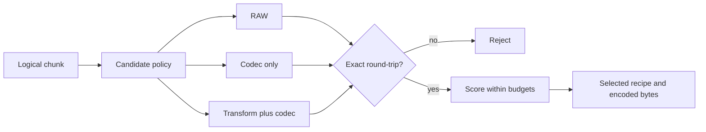
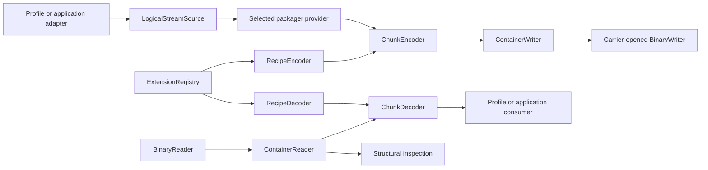

# OBST design notes

Parent: [Documentation index](README.md)

This document explains why the implemented architecture has its boundaries. It
is intentionally non-normative.

Use the [documentation index](README.md) to find authoritative format,
contract, API and CLI documentation. The [roadmap](../ROADMAP.md) alone owns
unfinished work. The [container anatomy](anatomy.md) defines the pieces whose
ownership this page explains.

## Table of contents

- [OBST design notes](#obst-design-notes)
	- [Table of contents](#table-of-contents)
	- [Ownership follows the bytes](#ownership-follows-the-bytes)
	- [Wire-visible and runtime extension points](#wire-visible-and-runtime-extension-points)
	- [Python distributions and activation](#python-distributions-and-activation)
	- [Manifest-first, chunked operation](#manifest-first-chunked-operation)
	- [Stream semantics are not container semantics](#stream-semantics-are-not-container-semantics)
	- [Recipes and contract identity](#recipes-and-contract-identity)
	- [The encoder may be clever](#the-encoder-may-be-clever)
	- [Structure discovery through transforms](#structure-discovery-through-transforms)
	- [Numeric representation and scale](#numeric-representation-and-scale)
	- [Recursion is composition](#recursion-is-composition)
	- [Design goals and non-goals](#design-goals-and-non-goals)
	- [Python operation boundaries](#python-operation-boundaries)

## Ownership follows the bytes

OBST is the representation layer between logical byte streams and their
storage or transport. It owns reversible representation, framing and integrity,
while application meaning and publication stay on opposite sides:


The application or stream profile owns units, timestamps, schemas, shapes and
record layouts. A pipeline stage owns one reversible byte contract. The
container owns framing, versioning, extension identities, recipe references and
integrity. The caller owns paths, database rows, object-store keys, credentials
and publication policy.

The ownership path stays explicit:

```text
application/domain format
    -> logical byte streams
    -> OBST representation
    -> OBST byte stream
    -> carrier
    -> storage or transport
```

Reading follows the same boundaries in reverse. It does not reverse ownership:
the carrier still knows the endpoint, OBST still knows only container and
logical bytes, and the application still decides what recovered bytes mean.

## Wire-visible and runtime extension points

Only contracts required by another implementation appear in the manifest.

| Extension point                 | Owns                                     | Wire-visible identity      |
| ------------------------------- | ---------------------------------------- | -------------------------- |
| Pipeline stage                  | Reversible byte representation           | Versioned stage ID         |
| Stream profile                  | Logical byte meaning and metadata        | Versioned stream type      |
| Packager policy                 | Recipes, chunking and tuning choices     | None                       |
| Carrier                         | Container input, output and publication  | None                       |
| Archiver or application adapter | Mapping domain inputs to logical streams | Only selected stream types |

Codecs and transforms are two useful descriptions of a stage, not separate
core APIs. Carriers and archivers are replaceable, but a decoder does not need
to know which carrier produced its input or which adapter assembled its
streams.

This keeps the core boring. First-party zlib, Delta8, file-profile and
filesystem implementations use the same public boundaries as third-party
implementations. They live in the independently installable `obst-defaults`
distribution and enter through ordinary plugin entry points. Their ownership
does not grant them a privileged execution path.

The exact Python surfaces live in the [Extension guides](extensions/README.md).

## Python distributions and activation

The reference project separates code installation from trusted runtime
composition:

| Distribution    | Contains                                                                  |
| --------------- | ------------------------------------------------------------------------- |
| `obst`          | `obst`, the carrier-neutral core, plugin manager, CLI host and inspection |
| `obst-defaults` | First-party Extensions and the file-oriented `pack` and `unpack` commands |

The split prevents first-party providers from acquiring a private loading
path. `obst-defaults` publishes the same `obst.extensions`, `obst.commands`
and `obst.conformance` entry-point kinds available to another distribution.
Installing it makes those entry points discoverable; enabling the
`obst-defaults` plugin explicitly admits its code into later operations. A
one-shot plugin selection or explicit conformance test can admit code for one
command without changing persistent activation state.

There is no code-free convenience distribution and no `obst -> obst-defaults`
dependency. Users who want both install both; the defaults plugin retains the
same dependency direction as a third-party plugin:

```console
pip install obst obst-defaults
```

A distribution is therefore an installation unit, a plugin is one named set
of entry-point contributions and an Extension is one registry object with an
exact capability ID. Container bytes may name wire-visible Stage and stream
contracts, but they cannot select a distribution, enable a plugin or expand
the host's trust set.

## Manifest-first, chunked operation

The manifest appears before payload chunks. It declares extension identities,
recipes and streams before a reader sees the first encoded payload.

That enables early structural and capability inspection, but it also means a
writer must know the final manifest before publishing the first chunk. The
low-level writer accepts that constraint instead of hiding buffering or policy
behind its API.

Chunks are independently framed so the ordinary reader can:

- consume a non-seekable source once;
- enforce manifest, chunk and intermediate size limits;
- validate per-stream sequence order;
- interleave logical streams;
- apply the recipe referenced by each chunk; and
- localize integrity failures.

One terminal commit follows the final chunk. It lets a single-pass writer bind
the observed chunk count, sizes and preceding bytes only when production has
actually completed. The reader does not treat an otherwise clean chunk-boundary
EOF as successful completion.

The fixed packager knows every recipe before writing. Recipe discovery over
arbitrary candidates requires a bounded spool before the manifest can be
finalized.

> [!NOTE]
> **Future semantics:** Production auto-tuning and two-pass spool packaging do
> not exist. They are tracked in the
> [roadmap](../ROADMAP.md#later-production-encoding).

## Stream semantics are not container semantics

A stream is logical bytes plus a versioned stream-type ID and opaque metadata.
The core can recover those bytes without understanding their application
meaning:



`obst.bytes@1` is the generic no-metadata contract. `obst.file@1` gives one
stream a portable basename and exact file contents. A database exporter or
telemetry application can define another profile without teaching the core
what a table or temperature is.

An optional metadata interpreter improves inspection output. It does not turn
the core into a universal semantic decoder.

## Recipes and contract identity

A recipe lists versioned stages in encoding order. Decoding applies their
inverse directions in reverse order:

```text
logical bytes -> transform -> codec -> encoded bytes
logical bytes <- inverse   <- decode <- encoded bytes
```

An extension ID names a language-neutral contract, not an implementation. The
contract includes parameter bytes, representation, inverse behavior, invalid
inputs and resource rules. Incompatible behavior receives a new versioned ID.

Finding a decoder under that ID permits a decode attempt; it does not prove the
provider is correct. OBST verifies the recovered chunk against its declared
logical size and hash. Independent conformance tests and golden vectors test
the broader implementation claim.

Registries are explicit and instance-local. Importing a package does not mutate
a process-wide registry or download code. The manifest's optional specification
URL is untrusted provenance and never extension identity.

## The encoder may be clever

The decoder executes the recipe written in the container. It does not need to
know why the encoder selected it.

An encoder may use a fixed application recipe, a small heuristic or a bounded
search. Its objective may include size, memory, encode time, decode time or
flash usage. RAW remains the correct result when no transformation improves the
payload enough.



Search history and rejected candidates are encoder diagnostics, not container
data.

Cleverness may also stay inside one Stage contract when every valid choice is
self-described and reversible. The installable
[`adaptive-zlib` example](../examples/plugin_adaptive_zlib/README.md) tries
declared byte layouts and preset dictionaries per chunk, records only the
winner and leaves the decoder with one deterministic inverse operation.

## Structure discovery through transforms

A general codec can use only patterns visible in the byte layout. A reversible
transform can expose structure without claiming to understand it.

Fixed-width records may begin as:

```text
ABCDEFGHIJKLMNOPQRSTUVWX
ABCDEFGHIJKLMNOPQRSTUVWX
ABCDEFGHIJKLMNOPQRSTUVWX
```

A width-24 byte shuffle could group equal columns:

```text
AAA...
BBB...
CCC...
...
XXX...
```

Such a transform becomes interoperable only after its parameters, inverse,
alignment behavior, invalid inputs and limits receive a versioned contract.

## Numeric representation and scale

Pipeline correctness means byte identity:

```text
decode(encode(input_bytes)) == input_bytes
```

Numeric equality is weaker. Signed zero and NaN payloads can have distinct bit
patterns, and arbitrary floats do not round-trip through a scaled integer.

Scaling therefore belongs to a versioned stream encoding. Its contract must
define integer width, byte order, decimal exponent, rounding, alignment and
rejected values. A deliberately lossy profile may quantize, but the loss
belongs to that application format, never to a stage advertised as reversible.

## Recursion is composition

An OBST container is bytes, so a logical stream may contain another complete
OBST container:

```text
OBST(OBST(OBST(...)))
```

The outer reader treats the inner container like any other payload. It does not
recurse because a filename ends in `.obst` or because recovered bytes begin
with OBST magic.

The same rule applies to files: the file Extension owns its metadata and
materialization contract, while the caller separately selects packaging and
storage. The [file guide](extensions/files.md#composition-boundary) owns that
concrete composition.

> [!NOTE]
> **Future semantics:** Nested inspection and repacking do not exist. Explicit
> selection and bounded resource policies are tracked in the
> [roadmap](../ROADMAP.md#later-directions).

## Design goals and non-goals

OBST aims to be:

- open and independently implementable;
- self-describing at the container and recipe level;
- streamable with bounded-memory readers;
- inspectable when local decoders are missing;
- explicit about integrity and corruption;
- extensible through stable, versioned identities;
- byte-exact at the container and recipe boundary; and
- small enough for a constrained C or C++ decoder.

OBST does not replace specialized semantic formats. PNG understands images,
Parquet understands columnar analytics and video codecs understand video. OBST
provides generic framing and reversible representation where that is useful.

## Python operation boundaries

The Python reference implementation follows the same ownership in both
directions. Profiles and application adapters produce or consume logical
streams. Recipe executors bind trusted stage providers, chunk operations apply
those recipes and the container reader or writer owns only framing and
integrity.



A transactional carrier publisher opens an unpublished `BinaryWriter` before
the prepared package operation runs and commits it only after writing returns
successfully. Failure aborts that unpublished target. A streaming carrier may
instead expose bytes progressively and cannot promise rollback. The carrier
therefore owns transport and publication, not chunk or recipe processing. The
[carrier guide](extensions/carriers.md) documents those lifecycles; the
[core guides](core/README.md) own the individual format operations.

```text
src/obst/core/                    carrier-neutral contracts and operations
src/obst/cli/                     generic command host, native inspection and rendering
plugins/defaults/src/             replaceable first-party plugin implementation
plugins/defaults/tests/           first-party provider and adapter tests
examples/plugin_adaptive_zlib/    independently installable example plugin
conformance/                      language-neutral container vectors
tests/                            runtime, boundary and repository integration tests
docs/                             specifications, guides and rationale
```

`obst.bytes@1` is the sole core stream contract. RAW, zlib, Delta8,
`obst.file@1`, carriers, packagers and archivers all live on the replaceable
side of the boundary.
