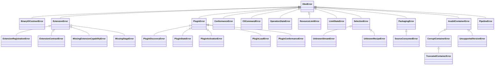

# Runtime errors

Parent: [Documentation index](README.md)

OBST distinguishes malformed container bytes, unavailable capabilities,
extension failures and endpoint failures. Callers should catch the narrowest
exception that they can handle instead of treating every failure as a corrupt
container.

## Table of contents

- [Runtime errors](#runtime-errors)
	- [Table of contents](#table-of-contents)
	- [Python exception hierarchy](#python-exception-hierarchy)
	- [Provider rejection boundary](#provider-rejection-boundary)
	- [Negative examples](#negative-examples)
		- [Missing capability is not corruption](#missing-capability-is-not-corruption)
		- [Missing runtime tooling is a host configuration failure](#missing-runtime-tooling-is-a-host-configuration-failure)
		- [Truncation is different from failed integrity](#truncation-is-different-from-failed-integrity)
		- [Local refusal is not invalid wire data](#local-refusal-is-not-invalid-wire-data)
	- [CLI failure contract](#cli-failure-contract)

## Python exception hierarchy

Expected OBST domain failures inherit from `ObstError`:



Ordinary `TypeError` and `ValueError` still report invalid Python arguments or
model construction. An underlying binary source may also raise `OSError`.
Wrong endpoint return types or impossible progress values instead raise
`BinaryIOContractError` before OBST changes its byte accounting.

Core failures are imported from `obst.core`. Adapter-specific failures remain
with the distribution that owns their semantics. The host-side plugin family
is imported from `obst.plugins`. The transport-neutral core defines Carrier
provider protocols, but does not know about paths, archives, installed
packages or local activation state. `ConformanceError` is imported from
`obst.conformance`; `CliCommandError` is imported from `obst.cli`.
`LimitStateError` is imported from `obst.limits` because it belongs to local
host configuration, not container processing.

| Exception                         | Meaning                                                                                                                                                                                |
| --------------------------------- | -------------------------------------------------------------------------------------------------------------------------------------------------------------------------------------- |
| `ObstError`                       | Base class for expected OBST domain failures. Catching it also catches unrelated failure families, so narrower types are preferable.                                                   |
| `BinaryIOContractError`           | A binary reader or writer returned the wrong type, over-read, stalled or reported impossible progress.                                                                                 |
| `ExtensionError`                  | Base class for missing, conflicting or invalid extension capabilities.                                                                                                                 |
| `ExtensionRegistrationError`      | A registry already owns the capability, descriptors conflict or one ID is used for incompatible extension kinds.                                                                       |
| `ExtensionContractError`          | Local provider code advertises unusable methods, returns an invalid value or raises an unexpected ordinary exception. The original runtime exception remains available as `__cause__`. |
| `MissingExtensionCapabilityError` | The host selected a carrier or packager capability that is absent from the immutable operation registry. Container bytes are not corrupt.                                              |
| `MissingStageError`               | A valid recipe needs an encoder or decoder that is absent from the supplied registry. The container is not corrupt.                                                                    |
| `PluginError`                     | Base class for host-side plugin discovery, state, loading and conformance failures. It never arises from container bytes alone.                                                        |
| `PluginDiscoveryError`            | Installed entry-point names are invalid, ambiguous, unavailable or split across different distributions.                                                                               |
| `PluginStateError`                | The local enabled-plugin state is malformed, unsupported, unreadable or cannot be persisted atomically.                                                                                |
| `PluginActivationError`           | The host tried to enable a discovered plugin that publishes no Extension, command or resource contribution.                                                                            |
| `PluginLoadError`                 | A selected trusted contribution cannot import, violates a factory or command contract, or cannot compose with the selected registries and resource catalog.                            |
| `PluginConformanceError`          | An explicit plugin test cannot load or validate the plugin's published `obst.conformance` contribution. Failed cases remain structured report results.                                 |
| `ConformanceError`                | A portable conformance suite, its claimed coverage or one local provider result violates the conformance contract.                                                                     |
| `CliCommandError`                 | A contributed CLI command maps one owned domain failure to the generic CLI error kind and exit-code contract.                                                                          |
| `OperationStateError`             | A single-use reader, writer or other stateful core operation was used after its valid phase.                                                                                           |
| `SelectionError`                  | Base class for a requested stream or recipe that the manifest does not declare.                                                                                                        |
| `UnknownStreamError`              | The requested stream ID is not declared by the manifest.                                                                                                                               |
| `UnknownRecipeError`              | The requested recipe ID is not declared by the manifest.                                                                                                                               |
| `PackagingError`                  | Logical sources cannot be packaged under the requested policy.                                                                                                                         |
| `SourceConsumedError`             | A single-use logical source was requested more than once.                                                                                                                              |
| `ResourceLimitError`              | A valid operation exceeds local resource policy. Structured fields name the resource, scope, maximum, observed value and phase.                                                        |
| `LimitStateError`                 | Local named-profile state is malformed, unavailable, immutable for the requested edit or cannot be persisted atomically.                                                               |
| `InvalidContainerError`           | Input bytes violate container structure, references, ordering or flags. Local policy refusal is a separate error family.                                                               |
| `CorruptContainerError`           | Recognizable OBST bytes fail an encoded checksum or decoded logical hash.                                                                                                              |
| `TruncatedContainerError`         | Input ends before a declared header, manifest, payload or terminal commit is complete.                                                                                                 |
| `UnsupportedVersionError`         | A structurally readable version field names an OBST or manifest version this implementation does not support.                                                                          |
| `PipelineError`                   | A known stage rejects parameters or payload bytes, or fails to recover the declared logical size.                                                                                      |

Several specialized exceptions expose structured fields such as `stage_id`,
`capability`, `direction`, `phase`, `stream_id`, `recipe_id`, `profile_id`,
`state`, `expected` and `actual`. `ResourceLimitError` additionally exposes
`resource`, `scope`, `maximum` and `observed`. Applications should prefer those
fields over parsing human-readable messages.

Reader and writer state errors are terminal where an operation may already
have consumed or emitted bytes. Retrying the same object does not resume it;
create a new operation from a valid source or destination instead. A concrete
Carrier documents its own state and retry semantics.

## Provider rejection boundary

`ProviderRejectedError` is deliberately not an `ObstError`. It is the public
signal by which a stage implementation rejects its own parameters, payload or
bounded output request. Extension code raises the exact class, not a subclass;
applications normally receive the resulting `PipelineError` after the core
adds the stage ID, direction and phase. A subclass or malformed rejection is a
provider-contract failure and becomes `ExtensionContractError`.

```python
from obst.core import ProviderRejectedError

rejection = ProviderRejectedError("dictionary identifier does not match")
assert rejection.reason == "dictionary identifier does not match"
```

Unexpected provider exceptions and invalid return values instead become
`ExtensionContractError`. When the public stage-output helpers detect a local
ceiling, the core uses its own exact rejection marker to carry the corresponding
`ResourceLimitError` through the provider boundary and restores that narrower
domain error outside it.

## Negative examples

### Missing capability is not corruption

Registry lookup reports the missing direction explicitly:

```python
from obst.core import ExtensionRegistry, MissingStageError

registry = ExtensionRegistry()

try:
    registry.require_decoder_provider("org.example/reverse@1")
except MissingStageError as error:
    assert error.stage_id == "org.example/reverse@1"
    assert error.capability == "decoder"
```

Structural [inspection](core/inspection.md) can still describe such a
container. Logical decoding cannot recover chunks that actually use the
missing stage.

### Missing runtime tooling is a host configuration failure

Carrier and packager lookups fail before binding a request:

```python
from obst.core import ExtensionRegistry, MissingExtensionCapabilityError

registry = ExtensionRegistry()

try:
    registry.require_packager_provider("org.example/fixed@1")
except MissingExtensionCapabilityError as error:
    assert error.extension_id == "org.example/fixed@1"
    assert error.capability == "packager provider"
```

The host may enable a trusted plugin that supplies the selected capability or
choose another provider. Container bytes cannot solve the failure by naming a
plugin, because carrier and packager IDs are not wire data.

### Truncation is different from failed integrity

An empty input ends before the fixed container header:

```console
$ obst inspect empty.obst
obst: truncated_container: truncated container header: expected 32 bytes, got 0
```

The command returns exit code `3`. A complete header with the wrong checksum
instead produces `corrupt_container`, also with exit code `3`. The error kind
preserves the distinction even when the broad process classification is the
same.

### Local refusal is not invalid wire data

A reader may reject a structurally valid container because the caller selected
a lower local ceiling:

```python
from obst.core import ContainerReader, CoreResource, LimitProfile, ResourceLimitError, ResourcePolicy

policy = ResourcePolicy(
    profile=LimitProfile(
        "small-manifest",
        "Accept manifests up to 1 KiB.",
        ((CoreResource.MANIFEST_BYTES, 1024),),
    )
)

try:
    ContainerReader(source, policy=policy)
except ResourceLimitError as error:
    assert error.resource is CoreResource.MANIFEST_BYTES
    assert error.maximum == 1024
```

The CLI reports the same family as `resource_limit` and returns exit code `10`.
Changing local policy may make the operation acceptable without changing the
container bytes. See [Resource policy](core/resources.md).

## CLI failure contract

CLI diagnostics use this form on stderr:

```text
obst: KIND: MESSAGE
```

`KIND` is the machine-oriented classification inside one exit-code family.
`MESSAGE` is for humans and may include paths or details from the operating
system. Do not parse it as a stable schema.

| Code | Error kind                                                      | Meaning                                                                                          |
| ---- | --------------------------------------------------------------- | ------------------------------------------------------------------------------------------------ |
| `0`  | none                                                            | Success. A missing decoder is still success for normal `inspect`.                                |
| `1`  | `internal_error`                                                | Internal command-dispatch failure.                                                               |
| `2`  | argparse usage                                                  | Invalid command-line syntax. Argparse owns the diagnostic format.                                |
| `3`  | `invalid_container`, `corrupt_container`, `truncated_container` | Invalid, corrupt or truncated container input.                                                   |
| `4`  | `unsupported_version`, or none                                  | Unsupported format version, or missing required decoder with `--require-decodable`.              |
| `5`  | `io_error`, `binary_io_contract_error`                          | Endpoint I/O failure or violation of the minimal binary reader/writer contract.                  |
| `6`  | `pipeline_error`                                                | An `ObstError` not mapped to a more specific CLI family, normally a pipeline or decoder failure. |
| `10` | `resource_limit`                                                | A valid operation was refused by its local resource policy.                                      |
| `11` | `plugin_error`                                                  | Plugin discovery, state, import, factory composition or explicit conformance failed.             |
| `12` | `limit_state`                                                   | Local named-profile state is invalid, unavailable or cannot be changed or persisted.             |

Native `inspect` reports failures opening or reading its local path or stdin as
`io_error` with exit code `5`. Contributed commands may define additional
error kinds and exit codes through `CliCommandError`; the contributing plugin
owns their documentation. For example, `obst-defaults` documents its
[file and Carrier failures](../plugins/defaults/docs/errors.md) separately.

`obst inspect --require-decodable` returns `4` without an error kind when the
stored container is valid but a stage required by an actual payload chunk is
unavailable. Normal inspection reports the missing capability and returns `0`.
