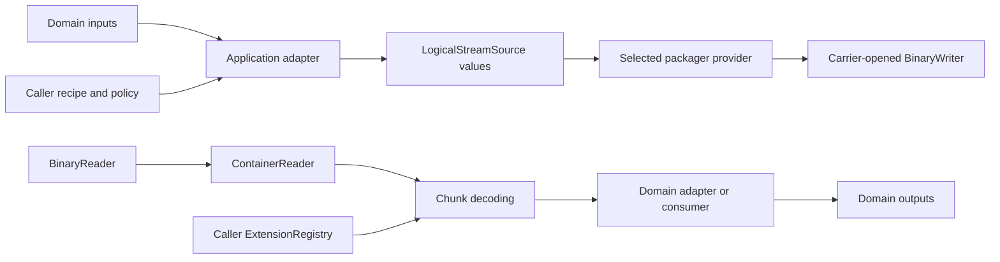

# Archivers and application adapters

Parent: [Extension system](README.md)

An archiver adapts domain inputs to OBST logical streams and reconstructs
domain outputs from decoded streams. It has no wire ID, registry entry or
privileged core access. Recipes, the generic [packager](../core/packaging.md),
[carriers](carriers.md) and runtime policy remain caller-owned composition.

There is no generic `Archiver` protocol. The first-party file archiver is a
concrete adapter for one domain, not an abstract base class invented for
symmetry.

## Table of contents

- [Archivers and application adapters](#archivers-and-application-adapters)
	- [Table of contents](#table-of-contents)
	- [Application-adapter boundary](#application-adapter-boundary)
	- [Compose an adapter](#compose-an-adapter)
	- [Build a domain adapter](#build-a-domain-adapter)
	- [First-party file adapter](#first-party-file-adapter)



## Application-adapter boundary

"Archiver" describes an application role, not one universal interface. A file
restorer, database exporter and model-bundle adapter have different domain
inputs, outputs and failure semantics. Giving them a shared base class would
hide those differences without giving the core a useful guarantee.

An adapter may use a versioned [stream profile](profiles.md), but it is not
itself an extension unless it contributes a wire-visible stage or stream
contract. It remains ordinary application code around public core operations.

An adapter may recognize domain-specific optional protocols on the trusted
Extension contributions captured by an `ExtensionRegistry`. That lets one
adapter support several versioned profile IDs without switching on concrete
Python classes or reading a provider's identity twice. The adapter owns those
protocols, their conflict rules and output policy; the core registry remains
unaware of filesystem or database semantics.

## Compose an adapter

The caller composes each boundary explicitly:

1. the application or profile serializes domain values to metadata and bounded
   logical chunks;
2. the adapter returns `LogicalStreamSource` values;
3. the selected packager provider prepares one container-writing operation;
4. a carrier owns the binary endpoint and publication lifecycle; and
5. recovery uses `ContainerReader`, the caller's registry and a domain-specific
   consumer.

No adapter receives hidden access to registry internals, wire framing or
carrier credentials.

## Build a domain adapter

An application adapter should:

1. define or select [stream-profile contracts](profiles.md);
2. serialize domain values into metadata and bounded logical chunks;
3. accept explicit `RecipeSpec` policy from its caller;
4. return `LogicalStreamSource` values to the selected packager; and
5. reconstruct its domain output from validated decoded chunks.

A small export-side adapter can use the public source types directly. The
`org.example/table@1` ID below is illustrative and is not shipped by OBST:

```python
from obst.core import (
    LogicalStreamDescriptor,
    LogicalStreamSource,
    RecipeSpec,
)


def table_source(
    *,
    recipe: RecipeSpec,
    metadata: bytes,
    table_dump: bytes,
    chunk_size: int,
) -> LogicalStreamSource:
    descriptor = LogicalStreamDescriptor(
        stream_type="org.example/table@1",
        metadata=metadata,
        default_recipe=recipe,
    )
    return LogicalStreamSource.from_bytes(
        descriptor,
        table_dump,
        chunk_size=chunk_size,
    )
```

The application still needs a language-neutral contract for that stream ID
and a matching recovery path. OBST supplies the container operations, not the
meaning of `metadata` or `table_dump`.

A database exporter can emit one stream per table or one stream per partition
without teaching the OBST core what a table is. Its API should model that
domain instead of inheriting from a generic archiver abstraction. Packaging,
publication and storage credentials stay outside it.

## First-party file adapter

The first-party [`FileExtension` and `FileArchiver`](files.md) are one concrete
implementation of this model. `FileArchiver` composes file-source and
file-materializer capabilities by exact profile ID, so one container may use
several supported file profiles. The file guide owns their Python API, source
validation, extraction behavior and filesystem-specific limits. The
[`obst.file@1` contract](../contracts/streams/file.md) separately owns their
wire-visible semantics.
