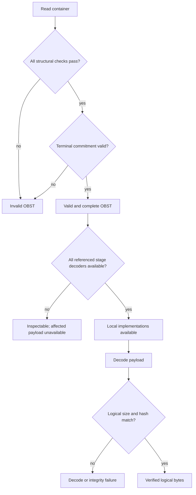

# OBST v0.1 binary format

Parent: [Documentation index](README.md)

Status: experimental, compatibility not frozen. The v0.1 vectors pin the
current draft and change with intentional pre-freeze wire revisions.

This document specifies the language-neutral container bytes implemented by the
Python reference reader and writer. It defines the framing and validity rules
that every conforming implementation must follow.

## Table of contents

- [OBST v0.1 binary format](#obst-v01-binary-format)
	- [Table of contents](#table-of-contents)
	- [Scope and conventions](#scope-and-conventions)
	- [Version identity](#version-identity)
	- [Container header](#container-header)
	- [Manifest](#manifest)
		- [Extension table](#extension-table)
		- [Recipe entries](#recipe-entries)
		- [Stream entries](#stream-entries)
		- [Stream contracts](#stream-contracts)
	- [Chunk framing](#chunk-framing)
	- [Terminal commit record](#terminal-commit-record)
	- [Validity and decoder availability](#validity-and-decoder-availability)
	- [Conformance vectors](#conformance-vectors)

## Scope and conventions

All integers are unsigned and little-endian.
All offsets are relative to the start of the structure being described. CRC
fields use CRC-32/ISO-HDLC (reflected polynomial `0xEDB88320`, initial register
`0xFFFFFFFF`, final XOR `0xFFFFFFFF`), as exposed by `zlib.crc32` with its
default initial value. A CRC covers the exact stored bytes named below.

All BLAKE2s-128 fields use unkeyed BLAKE2s with a 16-byte digest, no key,
salt or personalization. A logical chunk hash takes the exact logical chunk
payload before the first recipe stage. Each digest is stored as its 16 raw
bytes. The terminal content-hash input is defined with its record below.

The format defined here is a byte stream. A `.obst` filesystem entry is one
possible carrier, not part of the wire contract.

Non-normative rationale for chunking, recipes, manifest capability checks,
numeric streams and recursion lives in [design.md](design.md).
The Python reference implementation's scalar descriptors and reusable record
layouts are documented separately in [Python wire mapping](core/wire.md).

An OBST v0.1 byte stream consists of exactly one fixed container header, one
manifest, zero or more chunks and one terminal commit record:

```text
container header | manifest | chunk | chunk | ... | terminal commit
```

Readers support exactly version 0.1. Unknown flags, non-zero reserved fields,
unsupported header sizes, trailing manifest bytes and references to undeclared
streams or recipes are invalid in v0.1.

## Version identity

The canonical human-readable label for this format line is `OBST 0.1-apple`.
`apple` is the stable codename for major version `0`; every minor version in
major version `0` retains that codename. A codename is never reassigned to
another major version.

> [!NOTE]
> **Reserved semantics:** After the first compatibility freeze, an incompatible
> format line receives a new numeric major and a new codename.

The numeric major and minor remain the canonical machine-readable wire
identity. They are stored in both the container and manifest headers and must
agree with the version understood by the reader. The codename is a normative
alias derived from the major number, not a redundant string stored in v0.1.
Adding such a string would change the byte layout without providing
additional compatibility information.

## Container header

The container header is 32 bytes.

| Offset | Size | Type  | Field         | v0.1 value or meaning                   |
| -----: | ---: | ----- | ------------- | --------------------------------------- |
|      0 |    4 | bytes | magic         | ASCII `OBST`                            |
|      4 |    1 | u8    | version major | `0`                                     |
|      5 |    1 | u8    | version minor | `1`                                     |
|      6 |    2 | u16   | header size   | `32`                                    |
|      8 |    4 | u32   | flags         | `0`                                     |
|     12 |    4 | u32   | manifest size | complete manifest, including its header |
|     16 |    4 | u32   | stream count  | stream entries in the manifest          |
|     20 |    4 | u32   | recipe count  | recipe entries in the manifest          |
|     24 |    4 | u32   | reserved      | `0`                                     |
|     28 |    4 | u32   | header CRC-32 | CRC of bytes 0 through 27               |

The magic is stored as raw bytes. It is never packed as an integer and is
therefore never written as the historical `TSBO` byte sequence.

## Manifest

The manifest has a 24-byte header followed by a variable-size body.

| Offset | Size | Type  | Field           | v0.1 value or meaning             |
| -----: | ---: | ----- | --------------- | --------------------------------- |
|      0 |    4 | bytes | magic           | ASCII `MANF`                      |
|      4 |    1 | u8    | version major   | `0`                               |
|      5 |    1 | u8    | version minor   | `1`                               |
|      6 |    2 | u16   | header size     | `24`                              |
|      8 |    4 | u32   | extension count | extension table entries           |
|     12 |    4 | u32   | body size       | bytes following this header       |
|     16 |    4 | u32   | body CRC-32     | CRC of the complete manifest body |
|     20 |    4 | u32   | header CRC-32   | CRC of bytes 0 through 19         |

The complete manifest size in the container header includes this 24-byte
manifest header. Both sizes must fit their `u32` fields, so the manifest body
can contain at most `2^32 - 1 - 24` bytes.

The body contains, in order, every extension entry, every recipe entry and
every stream entry. Recipe and stream counts come from the container header.
At least one recipe and one stream are required. No padding or trailing bytes
are allowed.

### Extension table

Every extension entry begins with:

| Size | Type | Field                                                |
| ---: | ---- | ---------------------------------------------------- |
|    2 | u16  | extension ID size in bytes                           |
|    2 | u16  | specification URL size in bytes, `0` when undeclared |

The header is followed by the ASCII extension ID and then the optional ASCII
specification URL. Entries are unique and sorted by their encoded identifier.
Every entry is referenced by at least one recipe or stream. This canonical
order makes the complete manifest deterministic.

An extension identifier matches this complete ASCII regular expression:

```text
^[a-z0-9]+(?:[._-][a-z0-9]+)*(?:/[a-z0-9]+(?:[._-][a-z0-9]+)*)?@[1-9][0-9]*$
```

The namespace and optional name component begin and end with a lowercase ASCII
letter or digit. `.`, `_` and `-` are single separators and must be followed by
at least one lowercase ASCII letter or digit. Adjacent separators are invalid,
including two different separator characters. The version is a positive decimal
integer without a leading zero, so `@1` is valid while `@0` and `@01` are not.
Examples are `obst.raw@1`, `obst.bytes@1` and
`org.example/custom-transform@2`.

The `obst` namespace is reserved for extension contracts published as part of
OBST. Third-party contracts use a namespace controlled by their publisher,
such as `org.example`. An incompatible change to bytes, parameters, inverse
behavior or validation rules requires a new positive version after `@`.

The table contains both stream type identifiers and pipeline stage identifiers.
Indexes below are zero-based indexes into this table. Identity is the complete
identifier including its version.

A non-empty specification URL has an ASCII scheme followed by `:` and an
optional suffix. The scheme begins with an ASCII letter and continues with
ASCII letters, digits, `+`, `-` or `.`. The complete value contains only ASCII
characters and contains no whitespace, C0 control character or DEL. The encoded
value is at most 65,535 bytes. This is the complete v0.1 syntax check; readers do
not infer additional scheme-specific validity.

The URL is untrusted advisory provenance, not part of extension identity and
not a decoder download location. Readers may display it, but must not fetch it
or download or execute code from it. Missing or unreachable URLs do not affect
container validity.

### Recipe entries

Recipes have unique IDs and are sorted by `recipe_id`. A recipe entry starts
with:

| Size | Type | Field                   |
| ---: | ---- | ----------------------- |
|    4 | u32  | recipe ID               |
|    2 | u16  | stage count, at least 1 |
|    2 | u16  | reserved, `0`           |

It is immediately followed by `stage_count` stage entries in execution order:

|     Size | Type  | Field                   |
| -------: | ----- | ----------------------- |
|        4 | u32   | extension table index   |
|        4 | u32   | parameter size          |
| variable | bytes | opaque stage parameters |

Encoding executes stages from first to last. Decoding executes their inverses
from last to first. Parameter bytes are owned and versioned by the referenced
stage contract.

The container format does not define stage behavior. The standard first-party
contracts are specified independently:

| ID              | Parameter bytes                      | Normative contract                                                           |
| --------------- | ------------------------------------ | ---------------------------------------------------------------------------- |
| `obst.raw@1`    | empty                                | [`contracts/stages/raw.md`](contracts/stages/raw.md)                         |
| `obst.delta8@1` | empty                                | [`contracts/stages/delta8.md`](contracts/stages/delta8.md)                   |
| `obst.zlib@1`   | one u8 from 0 through 9              | [`contracts/stages/zlib.md`](contracts/stages/zlib.md)                       |
| `obst.zlib@2`   | level u8, then 1..32768 dictionary B | [`contracts/stages/zlib-dictionary.md`](contracts/stages/zlib-dictionary.md) |

### Stream entries

Streams have unique IDs and are sorted by `stream_id`. Each entry is:

|     Size | Type  | Field                       |
| -------: | ----- | --------------------------- |
|        4 | u32   | stream ID                   |
|        4 | u32   | stream type extension index |
|        4 | u32   | default recipe ID           |
|        4 | u32   | metadata size               |
| variable | bytes | opaque stream-type metadata |

Stream metadata is interpreted only by the declared stream type. OBST core does
not assign timestamp, channel, sample, unit or shape semantics.

### Stream contracts

The container carries a versioned stream-type ID and opaque metadata. It does
not define the logical meaning of that metadata or payload.

[`obst.bytes@1`](contracts/streams/bytes.md) is the sole core stream contract.
Other first-party and third-party profiles, including
[`obst.file@1`](contracts/streams/file.md), remain independent contracts.

## Chunk framing

Each chunk has a 64-byte header followed immediately by its encoded payload.

| Offset | Size | Type  | Field               | v0.1 value or meaning             |
| -----: | ---: | ----- | ------------------- | --------------------------------- |
|      0 |    4 | bytes | magic               | ASCII `CHNK`                      |
|      4 |    2 | u16   | header size         | `64`                              |
|      6 |    2 | u16   | flags               | `0`                               |
|      8 |    4 | u32   | stream ID           | declared stream                   |
|     12 |    8 | u64   | sequence            | zero-based, contiguous per stream |
|     20 |    4 | u32   | recipe ID           | declared recipe                   |
|     24 |    8 | u64   | logical size        | decoded payload size              |
|     32 |    8 | u64   | encoded size        | stored payload size               |
|     40 |    4 | u32   | payload CRC-32      | CRC of the encoded payload        |
|     44 |   16 | bytes | logical BLAKE2s-128 | hash of the logical payload       |
|     60 |    4 | u32   | header CRC-32       | CRC of bytes 0 through 59         |

Chunks from different streams may be interleaved. Each stream starts at
sequence zero and increments by one. End-of-input before the terminal commit,
inside any record or after only a prefix of a payload is truncation.

Logical and encoded sizes may each be zero at the framing layer. The selected
Stage contracts still determine whether an encoded payload is valid. A
zero-length chunk remains a chunk: it participates in stream sequencing, the
terminal chunk count and the terminal content commitment. It is distinct from
a stream with no chunks.

Readers validate declared payload sizes before reading those payloads. They
validate the manifest byte size before reading the manifest and its entry
counts before constructing the complete manifest object graph or decoding.

Those ceilings are implementation policy, not wire-format validity rules. The
Python reference uses one configurable `ResourceLimits` policy for reading,
writing and processing. Its defaults and complete-operation budgets are
documented in [Resource limits](core/resources.md). A local policy refusal does
not make an otherwise conforming container invalid.

## Terminal commit record

Every container ends with exactly one 64-byte terminal commit record. It is the
only successful end marker. EOF before it is truncation, and bytes after it are
invalid trailing data.

| Offset | Size | Type  | Field                | v0.1 value or meaning                        |
| -----: | ---: | ----- | -------------------- | -------------------------------------------- |
|      0 |    4 | bytes | magic                | ASCII `CMIT`                                 |
|      4 |    2 | u16   | record size          | `64`                                         |
|      6 |    2 | u16   | flags                | `0`                                          |
|      8 |    8 | u64   | chunk count          | number of preceding chunk records            |
|     16 |    8 | u64   | committed size       | bytes preceding this record                  |
|     24 |    8 | u64   | logical size         | sum of every chunk's declared logical size   |
|     32 |    8 | u64   | encoded payload size | sum of every chunk's encoded payload size    |
|     40 |   16 | bytes | content BLAKE2s-128  | hash of bytes 0 through `committed_size - 1` |
|     56 |    4 | u32   | reserved             | `0`                                          |
|     60 |    4 | u32   | record CRC-32        | CRC of bytes 0 through 59                    |

The committed byte range starts with the container header and ends with the
last encoded payload, or with the manifest when the container has no chunks.
It therefore binds the exact manifest, every chunk header, every encoded
payload and their physical order.

A reader validates the record CRC, observed record offset, observed chunk
count, accumulated logical and encoded-payload sizes and the content hash.
Removing a complete chunk suffix also removes the only valid terminal record;
retaining or moving the old record makes its counters or content hash fail.

The content hash detects accidental or untrusted-byte corruption. It is not an
authentication mechanism: a party able to rewrite the entire container can
also construct a new valid terminal record.

## Validity and decoder availability

Structural validation covers magic, versions, fixed sizes, reserved fields,
canonical manifest order, references, sequences, declared lengths, the
terminal commitment and all CRCs. Payload decoding is a separate capability
check.

A structurally valid container remains valid when a local registry lacks a
decoder for a declared pipeline stage. Inspection distinguishes all missing
declared stages from missing stages required by recipes referenced by actual
chunks. Attempting to decode an affected chunk fails with a missing-stage error,
not a corruption error.

A registered decoder means that the local implementation claims the named
language-neutral contract. Decoder registration alone permits a decode
attempt. After decoding, the logical decoding operation verifies both the
declared logical size and the logical BLAKE2s-128 hash. A wrong implementation
under the same ID therefore fails for that chunk unless it produces a hash
collision.

The logical hash does not prove that an implementation follows the stage
contract for every input, so stage publishers still need independent
conformance tests and golden vectors. It also provides integrity, not
authenticity: a party that can rewrite a container can recompute the logical
hash and header CRC.

Inspection does not run pipeline stages. It validates the chunk header CRC and
encoded payload CRC while preserving the declared logical hash for a later
decode.



The expected error classes are:

- invalid structure or reference
- unsupported container or manifest version
- truncated declared structure
- failed header, manifest or payload integrity
- missing or inconsistent terminal commitment
- valid container with a missing stage decoder
- known stage unable to decode its payload
- decoded payload with a wrong logical size or hash

## Conformance vectors

The public [`conformance/`](../conformance/) corpus separates 3 categories:

- Golden Vectors require exact reproduction by the Python reference writer;
- valid vectors require structural acceptance, followed by the cataloged
  recovery or missing-capability result; and
- invalid vectors require rejection at the cataloged structural or recovery
  phase under a language-neutral classification.

The minimal RAW container is the exact Golden Vector. The multi-chunk Delta8
plus zlib vector is decode-only because conforming zlib encoders may choose
different representations. Catalog schema 2 separates structural validation
from logical recovery so an unavailable Stage is never confused with a corrupt
container. The machine-readable catalog owns paths, SHA-256, feature tags,
required Extension IDs, phased outcomes, logical outputs and rejection rules.

The generated corpus covers every field of the 4 fixed records, truncation at
each record boundary, manifest ordering and reference rules, representative
Extension identifier and specification URL failures, interleaving, sparse and
maximum IDs, empty streams and chunks, terminal completeness, missing
capabilities and post-decode logical integrity. Stage-specific parameter spaces
remain in their independent contract suites instead of being duplicated here.

Before the first compatibility release, an intentional v0.1 wire change updates
this specification, the implementation and every affected vector together. After
publication freezes a compatibility promise, an incompatible change requires a
new format version and new vectors.
