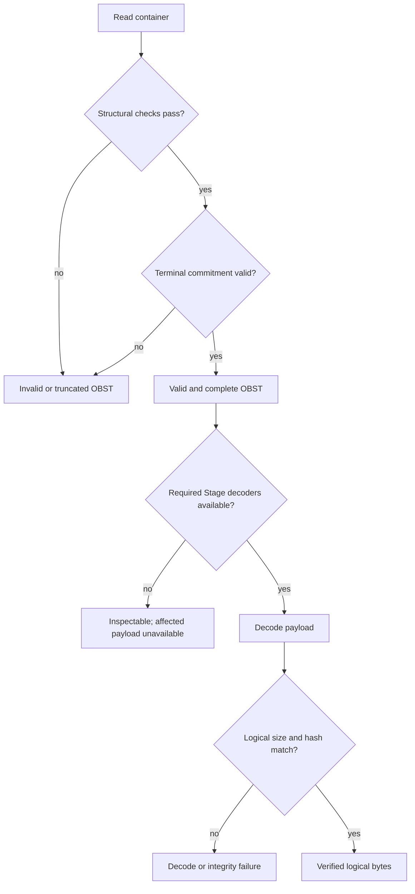

# OBST 0.2-apple binary format

Parent: [Documentation index](README.md)

Status: experimental, compatibility not frozen. The v0.2 vectors pin the
current draft and change with intentional pre-freeze wire revisions.

This document defines the language-neutral bytes of an OBST container. A
conforming implementation can use it to recognize the format, read every
record, decide whether the representation is valid and recover logical bytes
when the required decoders are available.

## Table of contents

- [OBST 0.2-apple binary format](#obst-02-apple-binary-format)
	- [Table of contents](#table-of-contents)
	- [Format at a glance](#format-at-a-glance)
		- [One container, several outcomes](#one-container-several-outcomes)
	- [Common byte rules](#common-byte-rules)
	- [Version identity](#version-identity)
	- [Container header](#container-header)
	- [Manifest](#manifest)
		- [Extension table](#extension-table)
		- [Recipe entries](#recipe-entries)
		- [Stream entries](#stream-entries)
	- [Chunk framing](#chunk-framing)
	- [Terminal commit record](#terminal-commit-record)
	- [Validity, availability and recovery](#validity-availability-and-recovery)
	- [Conformance vectors](#conformance-vectors)

## Format at a glance

An OBST byte stream has one opening header, one manifest, zero or more chunks
and one terminal commit:

```text
container header | manifest | chunk | chunk | ... | terminal commit
```

The manifest declares every Extension ID, Recipe and logical stream before the
first payload arrives. Each chunk then identifies one declared stream and one
declared Recipe. The terminal commit binds the complete representation and is
the only successful end marker.

OBST owns this framing and the reversible stored representation. It does not
assign application meaning to logical bytes and does not care whether the
completed byte stream is stored in a file, memory, a database BLOB or another
Carrier.

### One container, several outcomes

This record-level example shows how the declarations connect. It omits exact
sizes, CRCs and hashes; the [format corpus](../src/obst/conformance/corpus/)
contains complete byte vectors.

```text
OBST 0.2 header                              # [1] opens the representation
MANF                                         # [2] declares everything used below
  extension[0] = obst.bytes@1
  extension[1] = obst.delta8@1
  extension[2] = obst.zlib@1
  recipe[0] = extension[1] -> extension[2]
  stream[0] = type extension[0], recipe[0]
CHNK stream=0 sequence=0 recipe=0            # [3] stores one encoded chunk
CMIT                                         # [4] binds all preceding bytes
```

`[1]` tells a reader which fixed layouts follow. `[2]` gives later numeric
references their versioned meaning. `[3]` applies Delta8 and then zlib while
encoding; decoding runs their inverses in reverse order. `[4]` proves that the
stream reached its declared end without requiring a seekable Carrier.

The concrete Stage IDs come from the
[`obst-defaults` contracts](../plugins/defaults/docs/contracts/stages/README.md).
They make the example readable but are not built into this format.

Starting from the example, these changes exercise the main outcomes:

| Change                                                       | Result                                                                   |
| ------------------------------------------------------------ | ------------------------------------------------------------------------ |
| encode by Recipe and match every size, CRC and hash          | valid and recoverable when both Stage decoders are available             |
| remove the local `obst.zlib@1` decoder                       | still structurally valid; the chunk cannot be recovered locally          |
| make the first chunk sequence `1`                            | structurally invalid; every stream must begin at sequence `0`            |
| remove the chunk and update the terminal commit              | valid edge case; the declared stream contains no chunks                  |
| remove the terminal commit                                   | truncated; EOF is not a successful end marker                            |
| append one byte after the terminal commit                    | invalid trailing data                                                    |
| reject a declared size under a smaller local resource policy | local policy refusal; the same bytes may still be a conforming container |

## Common byte rules

All integers are unsigned and little-endian. All offsets are relative to the
start of the structure being described.

CRC fields use CRC-32/ISO-HDLC (reflected polynomial `0xEDB88320`, initial
register `0xFFFFFFFF`, final XOR `0xFFFFFFFF`), as exposed by `zlib.crc32` with
its default initial value. A CRC covers the exact stored bytes named below.

All BLAKE2s-128 fields use unkeyed BLAKE2s with a 16-byte digest, no key, salt
or personalization. A logical chunk hash takes the exact logical chunk payload
before the first Recipe Stage. Each digest is stored as its 16 raw bytes. The
terminal content-hash input is defined with its record below.

Readers of this format revision support exactly version 0.2. They reject
unknown flags, non-zero reserved fields, unsupported header sizes, trailing
manifest bytes and references to undeclared streams or Recipes.

Non-normative rationale for chunking, Recipes, capability checks, numeric
streams and recursion lives in [Design notes](design.md). The Python reference
implementation maps the fixed fields to reusable scalar and record descriptors
in [Python wire mapping](core/wire.md).

## Version identity

The canonical human-readable label is `OBST 0.2-apple`. `apple` is the stable
codename for major version `0`; every minor version in major version `0` keeps
that codename. A codename is never reassigned to another major version.

> [!NOTE]
> **Reserved semantics:** After the first compatibility freeze, an incompatible
> format line receives a new numeric major and a new codename.

The numeric major and minor are the machine-readable wire identity. Both the
container and manifest headers store them, and both must match the version
understood by the reader. The codename is derived from the major number and is
not stored as another string in v0.2. Adding it would change the byte layout
without adding compatibility information.

## Container header

The container starts with this 32-byte header:

| Offset | Size | Type  | Field         | v0.2 value or meaning                   |
| -----: | ---: | ----- | ------------- | --------------------------------------- |
|      0 |    4 | bytes | magic         | ASCII `OBST`                            |
|      4 |    1 | u8    | version major | `0`                                     |
|      5 |    1 | u8    | version minor | `2`                                     |
|      6 |    2 | u16   | header size   | `32`                                    |
|      8 |    4 | u32   | flags         | `0`                                     |
|     12 |    4 | u32   | manifest size | complete manifest, including its header |
|     16 |    4 | u32   | stream count  | stream entries in the manifest          |
|     20 |    4 | u32   | recipe count  | Recipe entries in the manifest          |
|     24 |    4 | u32   | reserved      | `0`                                     |
|     28 |    4 | u32   | header CRC-32 | CRC of bytes 0 through 27               |

The magic is stored as raw bytes, never as an integer. Writing the historical
little-endian integer representation `TSBO` therefore produces invalid magic.

## Manifest

The manifest begins immediately after the container header. It has a 24-byte
header followed by a variable-size body:

| Offset | Size | Type  | Field           | v0.2 value or meaning             |
| -----: | ---: | ----- | --------------- | --------------------------------- |
|      0 |    4 | bytes | magic           | ASCII `MANF`                      |
|      4 |    1 | u8    | version major   | `0`                               |
|      5 |    1 | u8    | version minor   | `2`                               |
|      6 |    2 | u16   | header size     | `24`                              |
|      8 |    4 | u32   | extension count | extension table entries           |
|     12 |    4 | u32   | body size       | bytes following this header       |
|     16 |    4 | u32   | body CRC-32     | CRC of the complete manifest body |
|     20 |    4 | u32   | header CRC-32   | CRC of bytes 0 through 19         |

The `manifest size` in the container header includes this 24-byte header. Both
sizes must fit their `u32` fields, so the body can contain at most
`2^32 - 1 - 24` bytes.

The body contains every extension entry, every Recipe entry and every stream
entry, in that order. Recipe and stream counts come from the container header.
At least one Recipe and one stream are required. Padding and trailing bytes are
not allowed.

A reader applies its local manifest-size and entry-count limits before reading
the complete manifest or constructing its object graph. The manifest header
then proves that the body occupies exactly the remaining declared bytes.

### Extension table

Each extension entry begins with:

| Size | Type | Field                                                |
| ---: | ---- | ---------------------------------------------------- |
|    2 | u16  | extension ID size in bytes                           |
|    2 | u16  | specification URL size in bytes, `0` when undeclared |

The ASCII extension ID follows the entry header, followed by the optional ASCII
specification URL. Entries are unique, sorted by their encoded identifier and
referenced by at least one Recipe or stream. The canonical order makes the
complete manifest deterministic.

An extension identifier matches this complete ASCII regular expression:

```text
^[a-z0-9]+(?:[._-][a-z0-9]+)*(?:/[a-z0-9]+(?:[._-][a-z0-9]+)*)?@[1-9][0-9]*$
```

The namespace and optional name component begin and end with a lowercase ASCII
letter or digit. `.`, `_` and `-` are single separators and must be followed by
at least one lowercase ASCII letter or digit. Adjacent separators are invalid,
including two different separator characters. The version is a positive
decimal integer without a leading zero: `@1` is valid, while `@0` and `@01` are
not. Complete examples are `obst.zlib@1`, `obst.bytes@1` and
`org.example/custom-transform@2`.

The `obst` namespace is reserved for contracts published as part of OBST.
Third-party contracts use a namespace controlled by their publisher, such as
`org.example`. An incompatible change to bytes, parameters, inverse behavior or
validation rules requires a new positive version after `@`.

The table contains both stream-type and pipeline-Stage identifiers. References
below are zero-based indexes into this table. Identity is the complete
identifier, including its version. The sets of identifiers referenced as
stream types and as Stages are disjoint: one identifier cannot serve both
roles in the same manifest.

A non-empty specification URL has an ASCII scheme followed by `:` and an
optional suffix. The scheme begins with an ASCII letter and continues with
ASCII letters, digits, `+`, `-` or `.`. The complete value contains only ASCII
characters and no whitespace, C0 control character or DEL. Its encoded length
is at most 65,535 bytes. Readers perform no additional scheme-specific syntax
check.

The URL is untrusted advisory provenance. It is neither part of extension
identity nor a decoder download location. Parsing and inspection may display
it, but container bytes must never trigger a fetch, download or code execution.
A missing or unreachable URL does not affect container validity.

### Recipe entries

Recipes have unique IDs and are sorted by `recipe_id`. Each entry starts with:

| Size | Type | Field                   |
| ---: | ---- | ----------------------- |
|    4 | u32  | recipe ID               |
|    2 | u16  | Stage count, `0..65535` |
|    2 | u16  | reserved, `0`           |

It is followed immediately by `stage_count` Stage entries in execution order:

|     Size | Type  | Field                   |
| -------: | ----- | ----------------------- |
|        4 | u32   | extension table index   |
|        4 | u32   | parameter size          |
| variable | bytes | opaque Stage parameters |

Encoding executes Stages from first to last. Decoding executes their inverses
from last to first. The referenced Stage contract owns and versions its opaque
parameter bytes.

A Recipe with zero Stages is the canonical identity representation. Its
forward and reverse execution both return the input bytes unchanged, it needs
no Stage provider, and it adds no Stage contract to the Extension table.

The container format does not define Stage behavior. Provider distributions
publish those contracts independently. The
[`obst-defaults` contract catalog](../plugins/defaults/docs/contracts/stages/README.md)
contains the first-party examples; their algorithms and parameter bytes are
not part of this specification.

### Stream entries

Streams have unique IDs and are sorted by `stream_id`. Each entry is:

|     Size | Type  | Field                       |
| -------: | ----- | --------------------------- |
|        4 | u32   | stream ID                   |
|        4 | u32   | stream-type extension index |
|        4 | u32   | default recipe ID           |
|        4 | u32   | metadata size               |
| variable | bytes | opaque stream-type metadata |

Every default Recipe ID references a declared Recipe. It does not constrain
later chunks: each chunk's own Recipe ID is authoritative and may name any
declared Recipe.

The declared stream type alone interprets the logical payload and metadata.
OBST core assigns no timestamp, channel, sample, unit or shape semantics.

[`obst.bytes@1`](contracts/streams/bytes.md) is the sole core stream contract.
Other first-party and third-party profiles remain independent contracts owned
by their implementing distributions. The plugin-owned
[`obst.file@1` contract](../plugins/defaults/docs/contracts/streams/file.md) is
one example.

## Chunk framing

Each chunk has a 64-byte header followed immediately by its encoded payload:

| Offset | Size | Type  | Field               | v0.2 value or meaning             |
| -----: | ---: | ----- | ------------------- | --------------------------------- |
|      0 |    4 | bytes | magic               | ASCII `CHNK`                      |
|      4 |    2 | u16   | header size         | `64`                              |
|      6 |    2 | u16   | flags               | `0`                               |
|      8 |    4 | u32   | stream ID           | declared stream                   |
|     12 |    8 | u64   | sequence            | zero-based, contiguous per stream |
|     20 |    4 | u32   | recipe ID           | declared Recipe                   |
|     24 |    8 | u64   | logical size        | decoded payload size              |
|     32 |    8 | u64   | encoded size        | stored payload size               |
|     40 |    4 | u32   | payload CRC-32      | CRC of the encoded payload        |
|     44 |   16 | bytes | logical BLAKE2s-128 | hash of the logical payload       |
|     60 |    4 | u32   | header CRC-32       | CRC of bytes 0 through 59         |

Chunks from different streams may be interleaved. Each stream starts at
sequence `0` and increments by `1`. EOF before the terminal commit, inside any
record or after only a payload prefix is truncation.

Logical and encoded sizes may each be zero at the framing layer. The selected
Stage contracts still determine whether the encoded payload is valid. A
zero-length chunk remains a chunk: it participates in sequencing, the terminal
chunk count and the terminal content commitment. It is distinct from a stream
with no chunks.

A reader applies its configured encoded-size ceiling before reading the
payload. Configured resource ceilings are implementation policy rather than
wire validity. The Python reference resolves one `ResourcePolicy` and tracks
reading, writing and processing through one operation-local
`ResourceAccounting`. [Resource policy and accounting](core/resources.md)
documents the defaults and recording rules. A local refusal does
not make conforming bytes invalid.

## Terminal commit record

Every container ends with exactly one 64-byte terminal commit. EOF before it is
truncation, and any byte after it is invalid trailing data.

| Offset | Size | Type  | Field                | v0.2 value or meaning                        |
| -----: | ---: | ----- | -------------------- | -------------------------------------------- |
|      0 |    4 | bytes | magic                | ASCII `CMIT`                                 |
|      4 |    2 | u16   | record size          | `64`                                         |
|      6 |    2 | u16   | flags                | `0`                                          |
|      8 |    8 | u64   | chunk count          | number of preceding chunk records            |
|     16 |    8 | u64   | committed size       | bytes preceding this record                  |
|     24 |    8 | u64   | logical size         | sum of every chunk's declared logical size   |
|     32 |    8 | u64   | encoded payload size | sum of every chunk's encoded payload size    |
|     40 |   16 | bytes | content BLAKE2s-128  | hash of bytes 0 through `committed_size - 1` |
|     56 |    4 | u32   | reserved             | `0`                                          |
|     60 |    4 | u32   | record CRC-32        | CRC of bytes 0 through 59                    |

The committed range starts with the container header and ends with the final
encoded payload, or with the manifest when the container has no chunks. It
therefore binds the exact manifest, every chunk header, every encoded payload
and their physical order.

A reader validates the record CRC, observed record offset, observed chunk
count, accumulated logical and encoded-payload sizes and the content hash.
Removing a complete chunk suffix also removes the only valid end marker.
Retaining or moving the old commit makes its counters or content hash fail.

The content hash detects accidental or untrusted-byte corruption. It is not an
authentication mechanism: a party able to rewrite the complete container can
also construct a new valid commit.

## Validity, availability and recovery

Structural reading validates the representation without invoking Extension
code. It covers magic, versions, fixed sizes, reserved fields, canonical
manifest order, references, sequences, stored record and payload lengths,
every CRC, terminal counters and the terminal commitment.

A structurally valid container remains valid when the local registry lacks a
decoder for a declared Stage. Only Stages used by Recipes referenced by actual
chunks are required for recovery. Attempting to decode an affected chunk fails
with a missing-Stage error, not a corruption error.

A registered decoder means that the local implementation claims the named
language-neutral contract. Registration permits a decode attempt. Afterward,
the logical operation verifies both the declared logical size and the logical
BLAKE2s-128 hash. A wrong implementation under the same ID therefore fails for
that chunk unless it produces a hash collision.

Inspection never runs Recipe Stages. It validates the chunk header CRC and
encoded payload CRC, reports decoder availability and leaves declared logical
size and hash verification to recovery.



Failures therefore remain distinguishable: unsupported version, invalid
structure or reference, truncation, stored-byte integrity failure, missing
terminal commitment, missing decoder, Stage decode failure and recovered-byte
size or hash failure.

Logical and content hashes provide integrity, not authenticity. They do not
prove that a decoder follows its contract for every input, and an actor able to
rewrite a container can recompute them. Stage publishers still need independent
conformance tests and golden vectors.

## Conformance vectors

The packaged [format corpus](../src/obst/conformance/corpus/) contains
structural cases with 2 broad results:

- accepted vectors require structural acceptance and the cataloged set of
  missing required Stages; and
- rejected vectors require the exact cataloged language-neutral outcome:
  invalid structure, corruption, truncation or unsupported version.

Catalog schema 2 can also express provider-owned logical recovery, but the core
format corpus deliberately contains only structural cases. An unavailable
Stage is therefore never confused with a corrupt container. The
machine-readable catalog owns exact bytes, SHA-256 digests, structural outcomes
and missing Extension IDs. Stage, profile and recovery vectors live in suites
owned by the distributions that implement those contracts.

The generated corpus covers every field of the 4 fixed records, truncation at
each record boundary, manifest ordering and reference rules, representative
Extension identifier and specification URL failures, interleaving, sparse and
maximum IDs, empty streams and chunks, terminal completeness, missing
capabilities and the declared logical size and hash fields. Stage-specific
parameter spaces remain in their independent contract suites instead of being
duplicated here.

Before the first compatibility release, an intentional v0.2 wire change updates
this specification, the implementation and every affected vector together.
After publication freezes a compatibility promise, an incompatible change
requires a new format version and new vectors.
