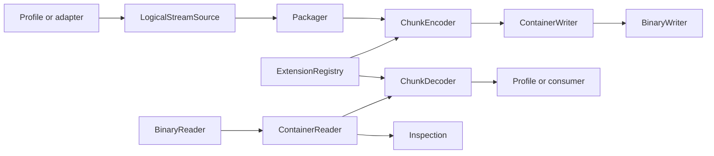

# OBST Python toolchain

Parent: [Documentation index](../README.md)

<!--
SPDX-FileCopyrightText: 2026 SmolBlackHole
SPDX-License-Identifier: MPL-2.0
-->

The OBST toolchain is the reference Python ecosystem around the
[OBST format](../format.md). It reads, writes, inspects, packages and decodes
OBST byte streams without becoming part of the format contract.

You can enter through the [CLI](cli.md), the in-memory example below, or a
specific [capability interface](extensions.md). These are independent starting
points. For the conceptual path, read [Anatomy](../anatomy.md) and
[Design](../design.md); for another implementation language, use the
[wire specification](../format.md) and [portable conformance cases](conformance.md#portable-suites).

`obst.core` owns transport-neutral operations and reversible execution. Other
toolchain modules own plugins, presentation and host-selected adapters. None of
them defines whether arbitrary bytes are a valid OBST container.

## Table of contents

- [OBST Python toolchain](#obst-python-toolchain)
	- [Table of contents](#table-of-contents)
	- [Format boundary](#format-boundary)
	- [Distributions and activation](#distributions-and-activation)
	- [Write and recover bytes in memory](#write-and-recover-bytes-in-memory)
	- [Operation boundaries](#operation-boundaries)
	- [Choose a guide](#choose-a-guide)
	- [Public boundary](#public-boundary)

## Format boundary

The [format specification](../format.md) defines record bytes, structural
validity and the built-in `obst.bytes@1` stream contract. This toolchain maps
those rules to Python APIs and adds local policy around them:

```text
OBST format
    -> Python reader and writer
    -> operation-local capabilities and resource policy
    -> caller-selected plugins, adapters and carriers
```

Changing a Python class, CLI command, plugin state file or default resource
profile does not create a new OBST wire revision. Changing the bytes or
validity rules in `format.md` does.

## Distributions and activation

The reference project separates runtime code from replaceable providers:

| Distribution    | Contains                                                                  |
| --------------- | ------------------------------------------------------------------------- |
| `obst`          | `obst`, the transport-neutral runtime, plugin manager, CLI and inspection |
| `obst-defaults` | First-party Extensions and the file-oriented `pack` and `unpack` commands |

`obst-defaults` publishes ordinary `obst.extensions`, `obst.commands`,
`obst.resources` and `obst.conformance` entry points. The `obst` distribution neither imports it
directly nor depends on it. Installation exposes inert metadata; an explicit
host decision admits plugin code into an operation.

A distribution is an installation unit. A plugin is one named set of entry
point contributions. An Extension is one registry object with an exact
capability ID. Container bytes may name Stage and stream contracts, but cannot
select a distribution, enable a plugin or expand the host's trust set. The
[plugin guide](plugins.md) owns commands, state and trust warnings.

## Write and recover bytes in memory

This round trip uses an empty identity Recipe and 2 in-memory endpoints.
No Stage provider or plugin is needed:

> [!WARNING]
> **Executable documentation:** The following Python block runs during tests
> with the current process privileges. It is not sandboxed.

```python
from io import BytesIO

from obst.core import (
    BYTES_STREAM_TYPE,
    DEFAULT_RESOURCE_POLICY,
    ContainerReader,
    ContainerWriter,
    ExtensionRegistry,
    Manifest,
    Recipe,
    ResourceAccounting,
    Stream,
    encode_chunk_once,
    materialize_stream,
)


payload = b"OBST is bytes before it becomes fruit."
registry = ExtensionRegistry(())
manifest = Manifest(
    recipes=(Recipe(0, ()),),
    streams=(Stream(0, BYTES_STREAM_TYPE),),
)

target = BytesIO()
accounting = ResourceAccounting(DEFAULT_RESOURCE_POLICY)
writer = ContainerWriter(target, manifest, accounting=accounting)
writer.write_chunk(
    encode_chunk_once(
        payload,
        stream_id=0,
        sequence=0,
        recipe=manifest.recipe(0),
        registry=registry,
        accounting=accounting,
    )
)
writer.finish()

reader = ContainerReader(BytesIO(target.getvalue()), accounting=accounting)
assert materialize_stream(reader, stream_id=0, registry=registry) == payload
```

The same core operations accept any compatible binary reader or writer. Files,
object stores and transactional publication remain adapter concerns.
To implement a byte operation yourself, continue with the executable
[Stage-provider example](extension-api/stages.md#provider-protocols).

## Operation boundaries

The implementation follows the same ownership in both directions:



Profiles and adapters own logical sources and consumers. Recipe and chunk
operations use the immutable registry selected for that operation. Readers and
writers own framing and integrity only. Carriers own endpoints and publication
lifecycle.

## Choose a guide

| Task                                            | Guide                                       |
| ----------------------------------------------- | ------------------------------------------- |
| Parse validated encoded chunks                  | [Reading](reading.md)                       |
| Write a known manifest and encoded chunks       | [Writing](writing.md)                       |
| Inspect structure without decoding              | [Inspection](inspection.md)                 |
| Configure bounded local work                    | [Resource policy](resources.md)             |
| Compose trusted extension capabilities          | [Extension system](extensions.md)           |
| Discover and activate installed providers       | [Plugin manager](plugins.md)                |
| Execute recipes and individual chunks           | [Recipes and chunks](internals/recipes.md)  |
| Turn logical chunk sources into one container   | [Packaging](internals/packaging.md)         |
| Understand immutable capability lookup          | [Extension registry](internals/registry.md) |
| Understand Python scalar and record layouts     | [Wire mapping](internals/wire.md)           |
| Use the command line                            | [CLI](cli.md)                               |
| Define application meaning for a stream          | [Stream profiles](extension-api/profiles.md) |
| Implement a reversible byte operation            | [Stages](extension-api/stages.md)           |
| Connect storage or transport                     | [Carriers](extension-api/carriers.md)       |
| Choose chunking and representation policy        | [Packagers](extension-api/packagers.md)     |
| Handle runtime failures                         | [Error reference](errors.md)                |
| Run portable conformance suites                 | [Conformance](conformance.md)               |
| Explore runnable programs and a complete plugin | [Examples](../../examples/README.md)        |
| Understand the exact bytes                      | [Format specification](../format.md)        |
| Understand format rationale                     | [Design notes](../design.md)                |

## Public boundary

`obst.core` is the supported public import boundary. Common entry points include:

```python
from obst.core import (
    ChunkDecoder,
    ChunkEncoder,
    ContainerReader,
    ContainerSummary,
    ContainerWriter,
    ExtensionRegistry,
    ManifestIndex,
    RecipeDecoder,
    RecipeEncoder,
    ResourceAccounting,
)
```

Generic resource definitions, catalogs, profiles and immutable policies are
public under `obst.resources`. The Core boundary exports the operation-local
accountant and its built-in resource set.

The root `obst` package exposes `FormatVersion` and the reference
implementation's `format_version` value. Concrete first-party codecs,
profiles, carriers, packagers and file adapters are supplied by the separate
`obst-defaults` distribution and imported from `obst_defaults`. Third-party
packages implement the same public core contracts.
