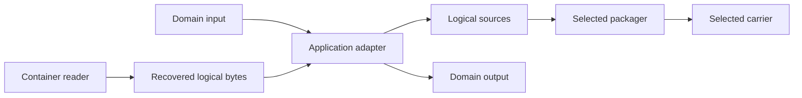

# Archivers and application adapters

Parent: [Extension system](../extensions.md)

<!--
SPDX-FileCopyrightText: 2026 SmolBlackHole
SPDX-License-Identifier: MPL-2.0
-->

An archiver turns domain inputs into logical OBST streams and reconstructs
domain outputs from recovered streams. It has no wire ID, registry entry or
privileged core access. "Archiver" names an application role, not a universal
Python interface.

## Table of contents

- [Archivers and application adapters](#archivers-and-application-adapters)
	- [Table of contents](#table-of-contents)
	- [Application-adapter boundary](#application-adapter-boundary)
	- [Compose an adapter](#compose-an-adapter)
	- [Build a domain adapter](#build-a-domain-adapter)
	- [Concrete application adapter](#concrete-application-adapter)

## Application-adapter boundary

A file restorer, database exporter and model-bundle adapter have different
inputs, outputs and failure semantics. A shared `Archiver` protocol would hide
those differences without giving the runtime a useful guarantee. Adapters are
therefore ordinary application code built around public OBST operations.

An adapter may use versioned [stream profiles](profiles.md) or recognize
domain-specific optional protocols exposed by trusted registry contributions.
It still owns those protocols, their conflict rules and its output policy. The
core registry does not learn filesystem, database or model semantics.

## Compose an adapter

The caller composes each boundary explicitly:

1. the domain adapter creates metadata and bounded logical chunks;
2. it exposes them as
   [`LogicalStreamSource`](../internals/packaging.md#define-one-logical-source) values;
3. a selected [packager](packagers.md) prepares the container-writing
   operation;
4. a selected [carrier](carriers.md) owns the binary endpoint and publication
   lifecycle; and
5. recovery uses the [container reader](../reading.md), the caller's
   registry and the adapter's own materialization policy.

The adapter does not receive hidden access to registry internals, wire framing
or carrier credentials. Recipes and resource policy remain explicit inputs
where the selected application needs to control them.

## Build a domain adapter

A domain adapter should model its real domain instead of inheriting from a
generic archive abstraction. It decides whether one table, partition, image or
model becomes one stream or several. It also owns semantic validation and the
rules for publishing recovered values.

The following boundaries are errors, not conveniences:

| Shortcut                                   | Why it is wrong                                                          |
| ------------------------------------------ | ------------------------------------------------------------------------ |
| infer a carrier from a filename suffix     | a carrier is selected by the host, not by container or domain bytes      |
| switch on concrete provider classes        | exact contract IDs and documented capabilities are the stable boundary   |
| put storage credentials in stream metadata | metadata describes the logical stream, not how this operation reached it |
| teach the core what a table or file means  | application meaning belongs to the profile and adapter                   |

The [packaging guide](../internals/packaging.md) owns the shared source and operation
contracts. A domain-specific stream ID still needs a language-neutral contract
and a matching recovery path.

## Concrete application adapter

The [`obst-defaults` file adapter](../../../plugins/defaults/docs/files/README.md)
is one implementation of this pattern. Its documentation owns the Python API,
source validation, extraction behavior, filesystem limits and wire-visible
file contract. This page owns only the composition pattern shared by
application adapters.
