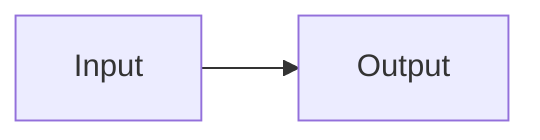

# Writing and maintaining OBST documentation

Parent: [Documentation index](README.md)

OBST documentation has one owner for each fact. A useful new page removes an
ambiguity or answers a concrete reader question. It should not create a second
place that must be kept vaguely in sync.

## Table of contents

- [Writing and maintaining OBST documentation](#writing-and-maintaining-obst-documentation)
	- [Table of contents](#table-of-contents)
	- [Choose the document by authority](#choose-the-document-by-authority)
	- [Link upward and sideways](#link-upward-and-sideways)
	- [Copy-paste a documentation page](#copy-paste-a-documentation-page)
	- [Describe the present by default](#describe-the-present-by-default)
	- [Keep normative contracts self-contained](#keep-normative-contracts-self-contained)
	- [Treat specification URLs as public links](#treat-specification-urls-as-public-links)
	- [Write diagrams as Mermaid source](#write-diagrams-as-mermaid-source)
	- [Keep working material private](#keep-working-material-private)
	- [Keep examples honest](#keep-examples-honest)
		- [Executable canonical examples](#executable-canonical-examples)
	- [Add and move pages](#add-and-move-pages)
	- [Review checklist](#review-checklist)

## Choose the document by authority

| Content                                                | Owner                         |
| ------------------------------------------------------ | ----------------------------- |
| Project purpose, first use and navigation              | Root `README.md`              |
| Conceptual container walkthrough                       | `docs/anatomy.md`             |
| Container framing and structural validity              | `docs/format.md`              |
| Python mapping of fixed wire fields and layouts        | `docs/core/wire.md`           |
| Interoperability evidence and conformance coverage     | `docs/conformance.md`         |
| Portable Golden, valid and invalid vector catalog      | `conformance/`                |
| Meaning of one versioned `obst.*` identifier           | `docs/contracts/`             |
| Python core operations                                 | `docs/core/`                  |
| Extension composition and capability lookup            | `docs/core/registry.md`       |
| Python extensions and adapters                         | `docs/extensions/`            |
| Python distribution layout and activation rationale    | `docs/design.md`              |
| First-party file adapter and extraction                | `docs/extensions/files.md`    |
| Shared carrier lifecycle and provider contracts        | `docs/extensions/carriers.md` |
| One first-party carrier's requests and guarantees      | `docs/extensions/carriers/`   |
| Packager provider boundary and first-party policies    | `docs/extensions/packagers*`  |
| Command syntax, successful output and command behavior | `docs/cli.md`                 |
| Runtime failures, Python exceptions and CLI exit codes | `docs/errors.md`              |
| Rationale for implemented boundaries                   | `docs/design.md`              |
| Unimplemented work                                     | `ROADMAP.md`                  |

If a paragraph fits two rows, split the facts by authority and link between
them. Do not copy the paragraph.

## Link upward and sideways

Every Markdown page below `docs/` begins with one `Parent:` link immediately
after its title. The parent is the nearest index or section overview, not
necessarily the directory that happens to contain the file.

Follow the parent link with a short introduction, normally three to five
rendered lines. It should state what the page explains, what it owns and, where
useful, what lies outside its scope. Readers should understand why the page
exists before they reach its first section.

Pages with at least two main sections then provide `## Table of contents`
before the first section. OBST uses the VS Code extension Markdown All in One
to recognize and update that list on save. Keep the extension's generated
shape, including its title and nested headings, instead of maintaining a
second hand-written format or generator. Small pages with fewer than two main
sections and navigation-only indexes may omit a redundant table of contents.

Cross-references between documentation pages are encouraged when another page
owns the next question or supporting detail. Link to that authority instead of
repeating its explanation. A cross-reference improves navigation; it does not
move ownership of the fact.

At the first substantive use of an OBST-specific term, link to the page that
owns it when the current page does not. Do not link every repetition. The
[container vocabulary](anatomy.md#the-pieces-at-a-glance) is the starting map,
not a second copy of every definition.

Normative contracts link to the contract index even though stages and stream
profiles also have implementation guides elsewhere.

## Copy-paste a documentation page

Use this as the starting point for an ordinary documentation page. Replace the
parent with the nearest useful index, then save the file so Markdown All in One
updates the table of contents.

````markdown
# Page title

Parent: [Nearest index](README.md)

Explain what this page owns and why somebody would read it.
State the boundary it documents and what belongs somewhere else.
Give the reader enough context to understand the first section.

## Table of contents

- [Page title](#page-title)
	- [Table of contents](#table-of-contents)
	- [First topic](#first-topic)
	- [Related documentation](#related-documentation)

## First topic

Describe supported present behavior. Link to the authoritative owner instead
of copying facts that belong in another document.

## Related documentation

- [Relevant page](relative-page.md)
````

Small navigation pages with fewer than two main sections may omit the table of
contents. Normative contracts follow their stricter outline below instead of
this generic shape.

## Describe the present by default

Unmarked documentation describes behavior that exists and is supported by the
source or tests.

Use one form when a future boundary is necessary to understand present
behavior:

```markdown
> [!NOTE]
> **Future semantics:** This behavior does not exist. It is tracked in the
> [roadmap](../ROADMAP.md#concrete-section).
```

Every Future Semantics note must:

- say plainly that the behavior does not exist;
- link to one concrete roadmap item;
- avoid reserving CLI syntax, Python names or wire bytes; and
- contain only enough detail to explain the present boundary.

Use `Reserved semantics` only when the present normative contract already
reserves a value or meaning:

```markdown
> [!NOTE]
> **Reserved semantics:** This field is zero in v0.1 and readers reject any
> other value.
```

Do not use `currently`, `planned`, `later` or `eventually` as informal status
markers. Put the work in the roadmap or describe the implemented behavior.

## Keep normative contracts self-contained

Every file in `docs/contracts/` follows the same outline where applicable:

1. status and complete versioned identifier;
2. contract type;
3. logical input and output;
4. parameter or metadata bytes;
5. forward operation;
6. inverse operation or reconstruction rule;
7. chunk boundaries and state;
8. invalid inputs;
9. size and resource behavior;
10. inspection representation;
11. conformance and golden vectors; and
12. Python reference implementation.

The contract must be implementable without reading Python source. Python code
may be linked as a reference, never used as the only definition.

## Treat specification URLs as public links

`ExtensionDescriptor.specification_url` is the single public reference URL for
an Extension. For a wire-visible Stage or stream profile, it should lead to the
language-neutral information needed to understand and decode that contract.
Fixed packaging may copy it into the manifest when the referenced descriptor
is registered. Carrier and packager IDs are runtime-only, so their URL remains
local registry metadata and is never serialized into container bytes.

Inspection therefore distinguishes two sources:

- **Declared specification** is untrusted provenance stored in the inspected
  container's manifest.
- **Local specification** comes from the `ExtensionDescriptor` registered in
  the inspecting process.

They may match, differ or be absent independently. Inspection displays both and
never fetches either URL. `Local` means local-registry provenance, not a local
filesystem path; the value is not derived from the declared URL.

First-party specification URLs must:

- point wire-visible Stage and stream-profile IDs to their normative contract;
- point runtime-only carrier and packager IDs to their dedicated documentation;
- use a stable repository path;
- avoid a heading fragment when the document itself is the contract;
- move with the contract when documentation is reorganized; and
- be covered by a local test that verifies the target exists.

Changing a first-party `specification_url` requires checking generated samples
when the owning Extension is wire-visible because the old URL may already be
embedded in existing manifests. A runtime-only URL change requires link and
inventory tests, but no wire artifacts.

## Write diagrams as Mermaid source

Use fenced `mermaid` blocks, never rendered Mermaid screenshots. Public
documentation uses Mermaid syntax supported by GitHub and leaves renderer
selection to the host:

````markdown

````

Do not select the ELK renderer. GitHub does not support that configuration and
shows the source block instead of a diagram. If the default layout makes a
graph unreadable, simplify or split the graph.

Use a table when exact fields or repeated mappings matter more than topology.
Do not add a diagram when one sentence is clearer.

## Keep working material private

`docs/audits/` and `docs/history/` are gitignored workspaces for investigations,
implementation plans, agent handoffs and other point-in-time material. They are
not part of the public documentation graph and must not be linked from tracked
documents.

Before removing local working material, transfer every lasting result to its
authoritative owner: implemented behavior to the relevant guide or contract,
unfinished work to the roadmap, and verified guarantees to tests. The public
repository keeps the result, not the desk on which it was discovered.

The public roadmap is direction, not a completion ledger or detailed design
document. Keep one current milestone, one next milestone and a short list of
later directions. Detailed acceptance criteria live in a private plan only
while that work is active. When work finishes, remove it from the roadmap and
update the authoritative implementation, tests and documentation instead of
keeping checked-off items.

## Keep examples honest

- Run commands against the checked-in CLI.
- Import neutral runtime names from `obst.core`, first-party implementation
  names from `obst_defaults` and example-plugin names from their own package.
- Mark illustrative IDs and stages as examples when OBST does not ship them.
- Preserve binary literals, identifiers, URLs and measured output exactly.
- Write measured quantities and counts with numerals, such as `8 MiB`, `1 byte`
  and `2 streams`, instead of spelling out the number.
- Do not present roadmap behavior as a runnable example.

Documentation tests parse public `python` fences and resolve every imported
`obst.*` and `obst_defaults.*` module and name. Ordinary fragments are not
executed, so they must still be reviewed for truthful behavior, safe bounds
and complete surrounding context.

### Executable canonical examples

The small examples that define a primary user journey use this exact warning
immediately before their Python fence:

> [!WARNING]
> **Executable documentation:** The following Python block runs during tests
> with the current process privileges. It is not sandboxed.

The warning is both a visible trust-boundary notice and the machine-readable
execution marker. A generic warning, an inline code comment or a detached
admonition does not make a block executable.

Documentation tests execute each marked fence independently from an empty
temporary working directory. A marked example must therefore be complete,
deterministic, bounded, offline and free of persistent side effects. Do not mark
fragments, illustrative third-party imports, commands requiring checked-in
sample files or examples that depend on execution order.

A Markdown change can therefore become executable CI input. Review changes to
the warning and its following Python block with the same care as source-code
changes. The temporary directory limits accidental output placement; it is not
a security sandbox.

Keep the set deliberately small. The core in-memory round trip and one complete
self-describing extension are canonical journeys; every nearby fragment does
not need to become an integration test.

## Add and move pages

When adding a public page:

1. add it to [the documentation index](README.md);
2. link it from the nearest layer index;
3. remove superseded prose instead of keeping a compatibility copy;
4. update links in the root README, format, design and CLI guides as needed;
5. update first-party `specification_url` values when their target moved;
6. rebuild checked-in samples when their manifests changed; and
7. run the documentation link checks and repository quality suite.

Run the reachability report from the repository root:

```bash
python scripts/documentation_graph.py
```

It prints one shortest link path from the root `README.md` to every tracked or
non-ignored new Markdown page. Deliberately gitignored local work is outside the
public documentation graph. Unreachable pages and unresolved local Markdown
targets make the command fail.

When Python wire layouts change, update the normative format first, then the
wire mapping, implementation tests, golden vectors and generated samples as
one format revision. The mapping documents the code shape; it does not take
ownership of the byte contract from `docs/format.md`.

Filenames do not carry contract versions. The full version remains in the
document title and stable identifier, such as `obst.zlib@1`.

## Review checklist

- Does the page open with its parent, a short introduction and, where useful,
  an updated table of contents?
- Is every unmarked claim implemented?
- Does each fact have one authoritative owner?
- Can an independent implementation follow every normative contract?
- Do all Future Semantics notes link to the roadmap?
- Do specification URLs resolve to normative contract pages?
- Are Mermaid diagrams stored as code?
- Do Mermaid diagrams render on GitHub without selecting an unsupported renderer?
- Has temporary audit or plan material been distilled into authoritative docs,
  tests or roadmap entries before it leaves the private workspace?
- Do examples use the supported public imports?
- Do installation examples distinguish the `obst` runtime distribution,
  separately installed `obst-defaults` and plugin activation?
- Can every Markdown page be reached from the root README?
- Are the root README and both documentation indexes still concise?
